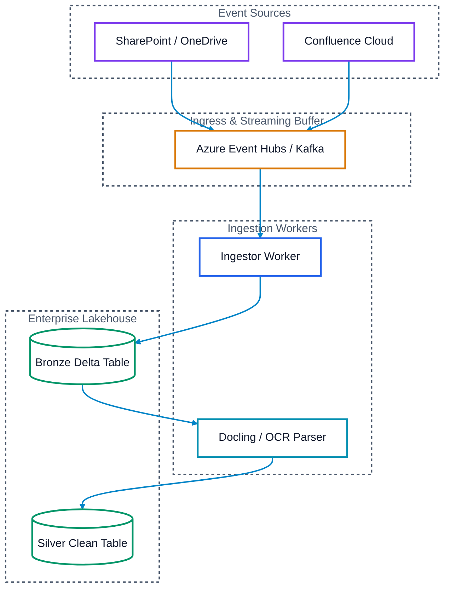
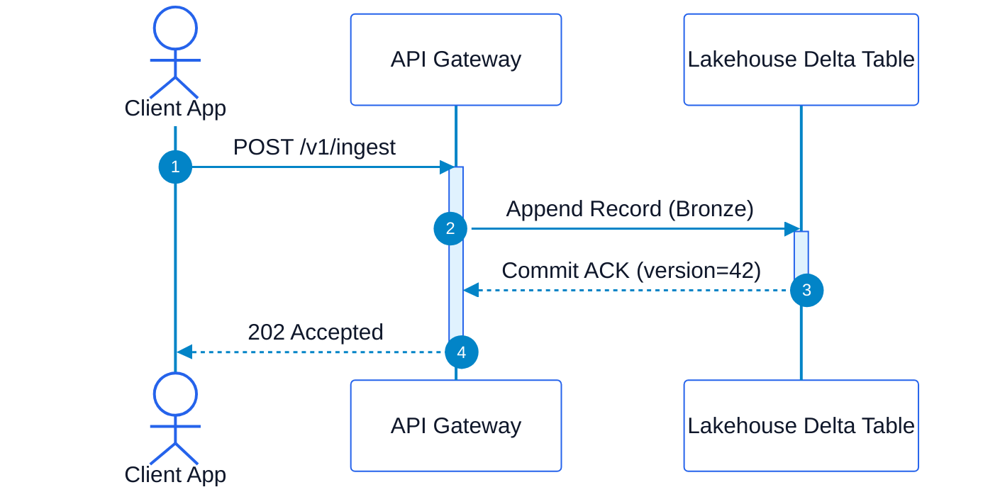

# Mermaid Dual-Mode Diagram Drawing Skill

## Overview
Mermaid diagrams in technical documentation (GitHub, Antigravity IDE / VS Code, Notion, Obsidian) frequently suffer from severe contrast failure when viewers switch between **Dark Mode** and **Light Mode**:
* **The "Colored Text on Dark" Trap**: Light blue, green, or red text on a dark slate background fails WCAG contrast standards and looks blurry/unreadable in both dark and light modes.
* **The "Invisible Box" Trap**: Dark slate boxes (`#1e293b`) blend directly into the dark editor background (`#1e1e1e` / `#0d1117`), making borders and structure vanish.
* **The "Faint Arrow" Trap**: Mid-gray arrows (`#94a3b8`) wash out on white backgrounds and disappear on dark backgrounds.

This skill establishes the **Dual-Mode Standards** that guarantee 100% crystal-clear readability (WCAG AAA compliance > 15:1 contrast ratio) across all themes.

---

## 1. The Core Color Rules (Non-Negotiables)

1. **The Golden Contrast Rule for Typography**:
   * **NEVER use colored text on node backgrounds** (e.g., do NOT use light blue, purple, or green font).
   * If the node fill is **Light/White (`#ffffff`)**: font color MUST be **Deep Charcoal (`#0f172a`)** (19:1 contrast).
   * If the node fill is **Dark/Midnight (`#0f172a`)**: font color MUST be **Pure White (`#ffffff`)** (16:1 contrast).
   * **Color must ONLY be applied to borders (`stroke`)**, indicators, and badges—never to the body text.
2. **Subgraphs Must Be Transparent**:
   * **NEVER** use solid background fills on subgraphs.
   * Use `style SubgraphId fill:none,stroke:#475569,stroke-width:2px,stroke-dasharray: 4 4,color:#475569`.
3. **Vibrant High-Visibility Link Arrows**:
   * Use saturated Cobalt Blue (`stroke:#0284c7,stroke-width:2px`) or High-Contrast Steel (`stroke:#334155,stroke-width:2px`).
   * Never use faint gray lines that fade into the background.

---

## 2. Standard Pattern: The "High-Luminance Card" (Recommended Default)

The **High-Luminance Card** pattern uses solid white tiles (`#ffffff`) with razor-sharp dark charcoal text (`#0f172a`) and a thick, saturated 2.5px colored border.

### Why this is the #1 choice for dual-mode readability:
* **In Dark Mode**: The white card acts as an illuminated surface against the dark canvas. The black text inside has an unbeatable **19:1 contrast ratio**, completely immune to ambient glare or editor theme shades.
* **In Light Mode**: The card integrates cleanly with the document, with the saturated 2.5px border providing crisp structural separation.

### Copy-Paste `classDef` Block

```mermaid
%% High-Luminance Dual-Mode Palette (WCAG AAA Compliant)
classDef default fill:#ffffff,stroke:#475569,stroke-width:2.5px,color:#0f172a;
classDef blue    fill:#ffffff,stroke:#2563eb,stroke-width:2.5px,color:#0f172a;
classDef green   fill:#ffffff,stroke:#059669,stroke-width:2.5px,color:#0f172a;
classDef amber   fill:#ffffff,stroke:#d97706,stroke-width:2.5px,color:#0f172a;
classDef purple  fill:#ffffff,stroke:#7c3aed,stroke-width:2.5px,color:#0f172a;
classDef red     fill:#ffffff,stroke:#dc2626,stroke-width:2.5px,color:#0f172a;
classDef cyan    fill:#ffffff,stroke:#0891b2,stroke-width:2.5px,color:#0f172a;
```

### Semantic Role Mapping
* **`:::blue`**: Core processing, microservices, orchestrators, APIs (`stroke:#2563eb`).
* **`:::green`**: Lakehouse tables (Bronze/Silver/Gold), databases, object storage (`stroke:#059669`).
* **`:::amber`**: Streaming brokers, event queues (Kafka, Event Hubs, SQS), caches (`stroke:#d97706`).
* **`:::purple`**: Gateways, webhooks, ingress sources (SharePoint, Confluence) (`stroke:#7c3aed`).
* **`:::red`**: Security, IAM, Entra ID, access control, DLP alerts (`stroke:#dc2626`).
* **`:::cyan`**: AI models, LLMs, embeddings, vector search indexes (`stroke:#0891b2`).

---

## 3. Alternative Pattern: The "Midnight High-Contrast" (Dark Tile Option)

When the design specifically calls for dark node tiles, you **must** use **Pure White text (`#ffffff`)** with glowing saturated neon borders:

```mermaid
%% Midnight High-Contrast Palette
classDef default fill:#0f172a,stroke:#64748b,stroke-width:2.5px,color:#ffffff;
classDef blue    fill:#0f172a,stroke:#38bdf8,stroke-width:2.5px,color:#ffffff;
classDef green   fill:#0f172a,stroke:#4ade80,stroke-width:2.5px,color:#ffffff;
classDef amber   fill:#0f172a,stroke:#fbbf24,stroke-width:2.5px,color:#ffffff;
classDef purple  fill:#0f172a,stroke:#c084fc,stroke-width:2.5px,color:#ffffff;
classDef red     fill:#0f172a,stroke:#f87171,stroke-width:2.5px,color:#ffffff;
classDef cyan    fill:#0f172a,stroke:#22d3ee,stroke-width:2.5px,color:#ffffff;
```
*(Notice: `color` is ALWAYS `#ffffff`. Never tint the text color!)*

---

## 4. Complete Flowchart Example



---

## 5. Sequence Diagram Dual-Mode Standard

Sequence diagrams do not support `classDef`. Use this pre-tuned `%%{init: ...}%%` block:



---

## 6. Pre-Commit Verification Checklist

Before saving any Mermaid diagram:
* [ ] Is text font color explicitly set to **`#0f172a`** (on white cards) or **`#ffffff`** (on dark cards)?
* [ ] Are there **ZERO** instances of pastel/colored text (e.g. no `#60a5fa`, `#34d399`, `#a78bfa` font colors)?
* [ ] Are node borders set to a saturated accent with `stroke-width: 2.5px`?
* [ ] Are subgraphs set to `fill:none` or `fill:transparent`?
* [ ] Are arrow links visible across both dark and light modes (`stroke:#0284c7`)?
