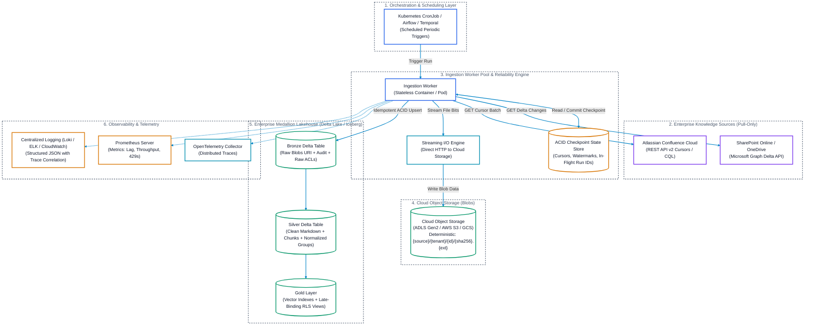
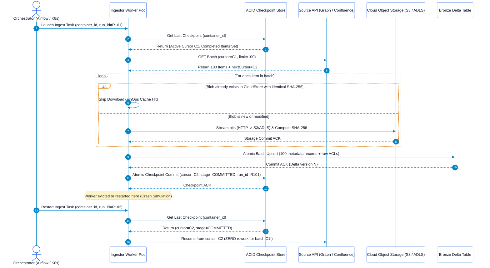

# Enterprise Pull-Based Document Ingestion Architecture

## Executive Summary
This architecture documentation suite details the end-to-end design for **pull-based, incremental ingestion** of unstructured enterprise documents and knowledge bases (Microsoft SharePoint, OneDrive, and Atlassian Confluence) into an **Enterprise Data Lakehouse** (Delta Lake / Apache Iceberg).

The ingestors are engineered to fulfill four core operational requirements:
1. **Pull-Based Approach**: Controlled, scheduled polling via native enterprise APIs without requiring inbound public webhooks, open ingress firewall ports, or public IP endpoints.
2. **Incremental Ingestion**: Native delta queries and cursor pagination that track creates, updates, and deletes with zero brute-force full scans.
3. **Mid-Process Restart Without Rework**: Checkpointed state machines, deterministic content-addressable storage paths, and two-phase batch commits that enable workers to crash and resume seamlessly without redundant downloads, parsing, or OCR.
4. **Enterprise Observability**: Integrated OpenTelemetry distributed tracing, Prometheus metrics catalog, structured JSON audit logging, and automated alerting.

---

## Architectural Suite Navigation

| Document | Primary Focus | Key API / Strategy |
| :--- | :--- | :--- |
| [SharePoint Pull Ingestor](file:///c:/Users/ToanBX/dev/personal/document_ingestors/docs/architectures/sharepoint_pull_ingestor_architecture.md) | SharePoint Document Libraries, Site Lists & OneDrive | Microsoft Graph Delta Query API (`/delta`), `@odata.deltaLink`, `cTag`, `eTag` |
| [Confluence Pull Ingestor](file:///c:/Users/ToanBX/dev/personal/document_ingestors/docs/architectures/confluence_pull_ingestor_architecture.md) | Confluence Cloud & Data Center Spaces, Pages, Blogposts, Attachments | REST API v2 Cursor Traversal (`sort=-modified-date`), Descending Early-Exit, CQL sliding window |

---

## High-Level System Ingestion Topology

---

## Cross-Cutting Architectural Pillars

### 1. Decoupled Storage: Blobs vs. Lakehouse Tables
* **Zero Binary Storage in Tables**: Under no circumstances are raw binary files (PDFs, DOCXs, PPTXs) stored directly in Parquet, Delta Lake, or Iceberg columns (`BLOB`, `BYTEA`).
* **Deterministic Object URIs**: Raw file bitstreams are streamed directly to Cloud Storage under content-addressed paths:
  $$\text{URI} = \text{scheme}://\text{bucket}/\text{source\_system}/\text{tenant\_id}/\text{container\_id}/\text{item\_id}/\{\text{content\_sha256}\}.\text{ext}$$
* **Lakehouse as the Metadata Brain**: Lakehouse tables only store cloud URIs, document headers, ACLs, and extraction states.

### 2. The Mid-Process Restart Engine (Zero-Rework Architecture)
Ingesting large enterprise workspaces involves long-running network operations across tens of thousands of files. Unplanned worker restarts (e.g., Kubernetes node eviction, OOM kill, network socket drop, or scheduled maintenance) must **never** cause the ingestor to re-download, re-parse, or re-embed already processed items.

#### The Zero-Rework Mechanics:
1. **Two-Phase Checkpointed Batches**: Cursors/page links are only advanced in the State Store after the entire batch of blobs is uploaded to Cloud Storage and written into the Bronze Delta table.
2. **Pre-flight Checksum Bypass**: Before streaming a file, the worker compares the source's content hash/eTag against the Lakehouse catalog. If identical, binary download and transformation are skipped.
3. **Atomic Watermark Promotion**: High watermarks (e.g., `@odata.deltaLink` or global modification timestamps) are only promoted to the production state store once the entire delta pagination cycle completes successfully.
4. **Idempotent Upserts**: Writing to the Lakehouse uses deterministic primary keys `(source_system, tenant_id, container_id, item_id, version_id)`. Re-executing an interrupted partial batch produces identical, non-duplicative state.

---

### 3. Zero-Trust Access Control (Late Binding)
* **Never Flatten Permissions Prematurely**: Raw ACLs (SharePoint role assignments, Confluence space permissions, and page restrictions) are captured in Bronze untouched.
* **Normalized Groups in Silver**: Security principals are mapped to normalized enterprise identifiers (e.g., Entra ID Group Object IDs) and attached to document chunks.
* **Query-Time Enforcement (Late Binding)**: Permissions are never baked statically into embeddings. Downstream search and RAG queries evaluate user group intersections at query execution time:
  $$\text{Authorized Access} \iff \left( \text{User Evaluated Groups} \cap \text{Chunk Allowed Groups} \neq \emptyset \right)$$

---

### 4. Telemetry & Observability Standard
Every ingestor pod exports real-time telemetry:
* **Prometheus Metrics**: High-frequency operational counters and gauges exposed on `/metrics`.
* **OpenTelemetry Distributed Tracing**: Spans covering API requests, blob streaming throughput, and Lakehouse write latencies.
* **Structured JSON Logs**: Machine-readable logs enriched with `trace_id`, `span_id`, `tenant_id`, `container_id`, `item_id`, and `run_id`.
* **Health Probes**: Kubernetes liveness (`/healthz`) and readiness (`/readyz`) endpoints monitoring state store connectivity and token freshness.
