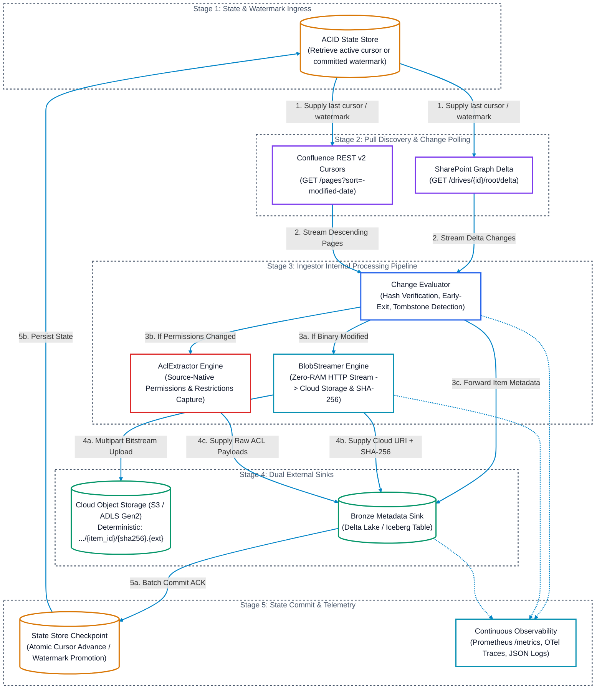
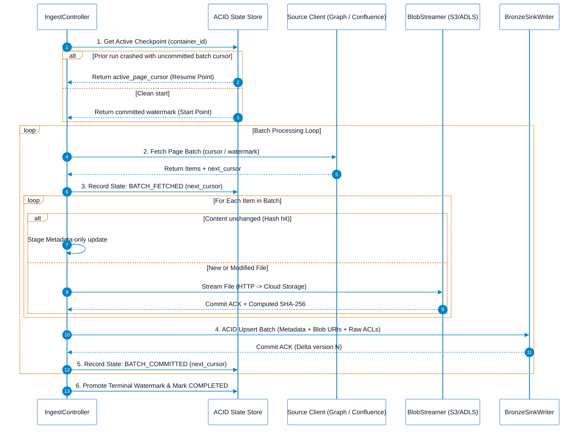

# Enterprise Pull-Based Document Ingestor Architecture

## Executive Summary
This architecture suite specifies the design, internal modular components, reliability mechanics, and boundary interfaces of the **Enterprise Document Ingestors** (Microsoft SharePoint & Atlassian Confluence). 

The ingestors are standalone, stateless data extraction engines responsible for discovering, streaming, and recording unstructured enterprise documents into object storage and raw Lakehouse metadata tables. Downstream transformations (such as Markdown parsing, OCR, chunking, embedding generation, and vector indexing) are completely decoupled and managed by downstream consumers.

---

## Architectural Suite Navigation

| Architecture Specification | Primary Source Target | Core Ingestion Engine |
| :--- | :--- | :--- |
| [SharePoint Pull Ingestor](file:///c:/Users/ToanBX/dev/personal/document_ingestors/docs/architectures/sharepoint_pull_ingestor_architecture.md) | SharePoint Document Libraries, Site Lists & OneDrive | Microsoft Graph Delta Query API (`/delta`), `@odata.deltaLink`, `cTag`, `eTag` |
| [Confluence Pull Ingestor](file:///c:/Users/ToanBX/dev/personal/document_ingestors/docs/architectures/confluence_pull_ingestor_architecture.md) | Confluence Spaces, Pages, Blogposts, Attachments | REST API v2 Cursor Traversal (`sort=-modified-date`), Descending Early-Exit, CQL sliding window |

---

## 1. Ingestor System Boundary & Architecture

The Ingestor operates as an isolated, containerized daemon or worker pod. It connects to the outside world exclusively through four well-defined interfaces:

---

## 2. Ingestor Core Features

### 2.1 Feature 1: Pure Pull-Based Approach
* **Zero Ingress Attack Surface**: The ingestor issues only outbound HTTPS requests (`TCP:443`). No public webhooks, inbound firewall rules, or reverse proxies are required.
* **Controlled Batch Fetching**: Ingestion runs are initiated by an enterprise orchestrator (e.g., Kubernetes CronJob, Airflow DAG, or Temporal Workflow) according to desired business intervals (e.g., every 15 minutes, hourly, or daily).

### 2.2 Feature 2: Native Incremental Synchronization
* **Zero Brute-Force Scanning**: The ingestor never scans entire document libraries or spaces during recurring runs.
* **Opaque Delta Links (SharePoint)**: Graph `@odata.deltaLink` pointers mark the exact transaction log offset, tracking additions, edits, renames, and deletions.
* **Descending Early-Exit Traversal (Confluence)**: Pages are polled with `sort=-modified-date`. The ingestor halts pagination the moment an item's modification timestamp is older than or equal to the committed watermark.
* **Fast-Path Checksum Bypassing**: Content hashes (`quickXorHash`, `cTag`, or on-the-fly computed `SHA-256`) are checked before downloading. If the hash matches the Lakehouse catalog, binary downloads are skipped and only metadata is updated.

### 2.3 Feature 3: Mid-Process Restart Without Rework
When an ingestor pod crashes, suffers an OOM event, or is evicted by the orchestrator, it must resume without re-downloading or re-processing completed items.

#### Reliability Guarantees:
1. **Two-Phase Checkpoint Commits**: Pagination cursors (`@odata.nextLink` or Confluence cursors) are only committed to the State Store *after* the entire batch has been successfully written to Cloud Storage and Bronze.
2. **Content-Addressable Idempotency**: Storage keys follow deterministic paths:
   $$\text{URI} = \text{scheme}://\text{bucket}/\text{source}/\text{tenant\_id}/\text{container\_id}/\text{item\_id}/\{\text{content\_sha256}\}.\text{ext}$$
   If a crash occurs mid-batch, subsequent retries discover the file already in storage via `HEAD` check and skip re-uploading.
3. **Graceful Termination Handlers**: POSIX `SIGTERM`/`SIGINT` signals are trapped. The ingestor finishes the current in-flight item, commits the page cursor, and exits cleanly.

### 2.4 Feature 4: Decoupled Zero-Buffer Blob Streaming
* **Zero RAM Buffering**: The ingestor never reads large documents into memory. Responses from Microsoft Azure CDN or Atlassian Media CDN are piped chunk-by-chunk directly into cloud storage multi-part uploads.
* **On-the-Fly SHA-256**: The cryptographic checksum is computed incrementally across chunks during stream transfer, eliminating the need for a secondary read pass.

### 2.5 Feature 5: Raw ACL & Security Capture
* **Zero Loss / No Premature Flattening**: The ingestor captures raw permission payloads (SharePoint role assignments and Confluence restrictions) and writes them directly into the Bronze `raw_acls` column.
* **Fail-Closed Principle**: If permission retrieval fails due to transient API errors, the item is tagged with `is_restricted = TRUE` to prevent unauthorized consumption.

### 2.6 Feature 6: Ingestor-Specific Observability
* **Prometheus Metrics**: Process-level throughput, active cursors, API throttle rates (HTTP 429s), bytes streamed, and watermark lag.
* **OpenTelemetry Distributed Traces**: Spans tracking `fetch_page`, `stream_blob`, `fetch_acl`, and `sink_commit`.
* **Structured JSON Audit Logs**: Uniform machine-readable log records enriched with `run_id`, `container_id`, `item_id`, `trace_id`, and `duration_ms`.
