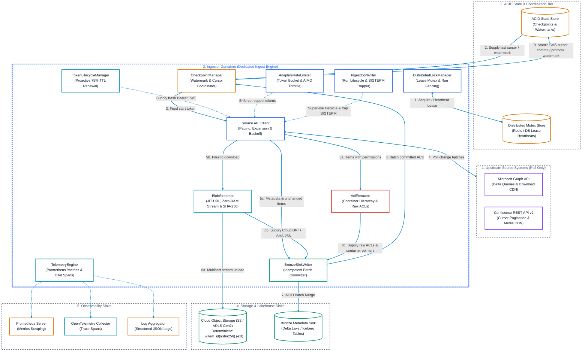
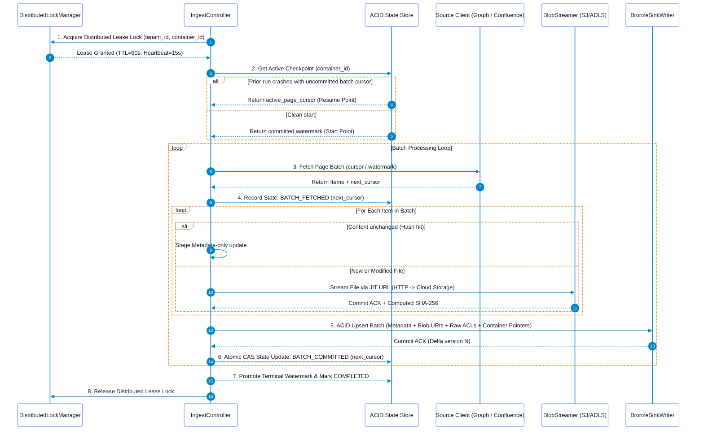

# Enterprise Pull-Based Document Ingestor Architecture

## Executive Summary
This architecture suite specifies the design, internal modular components, reliability mechanics, and boundary interfaces of the **Enterprise Document Ingestors** (Microsoft SharePoint & Atlassian Confluence). 

The ingestors are standalone, stateless data extraction engines responsible for discovering, streaming, and recording unstructured enterprise documents into object storage and raw Lakehouse metadata tables. Downstream transformations (such as Markdown parsing, OCR, chunking, embedding generation, and vector indexing) are completely decoupled and managed by downstream consumers.

---

## Architectural Suite Navigation

| Architecture Specification | Primary Source Target | Core Ingestion Engine |
| :--- | :--- | :--- |
| [SharePoint Pull Ingestor](file:///c:/Users/ToanBX/dev/personal/document_ingestors/docs/architectures/sharepoint_pull_ingestor_architecture.md) | SharePoint Document Libraries, Site Lists & OneDrive | Microsoft Graph Delta Query API (`/delta`), `@odata.deltaLink`, `cTag`, `eTag` |
| [Confluence Pull Ingestor](file:///c:/Users/ToanBX/dev/personal/document_ingestors/docs/architectures/confluence_pull_ingestor_architecture.md) | Confluence Spaces, Pages, Blogposts, Attachments | REST API v2 Cursor Traversal (`sort=-modified-date`), Descending Early-Exit with 15m Sliding Window |

---

## 1. Ingestor System Boundary & Architecture

The Ingestor operates as an isolated, containerized daemon or worker pod. It connects to the outside world exclusively through four well-defined interfaces:



---

## 2. Ingestor Core Features

### 2.1 Feature 1: Pure Pull-Based Approach
* **Zero Ingress Attack Surface**: The ingestor issues only outbound HTTPS requests (`TCP:443`). No public webhooks, inbound firewall rules, or reverse proxies are required.
* **Controlled Batch Fetching**: Ingestion runs are initiated by an enterprise orchestrator (e.g., Kubernetes CronJob, Airflow DAG, or Temporal Workflow) according to desired business intervals (e.g., every 15 minutes, hourly, or daily).

### 2.2 Feature 2: Native Incremental Synchronization
* **Zero Brute-Force Scanning**: The ingestor never scans entire document libraries or spaces during recurring runs.
* **Opaque Delta Links (SharePoint)**: Graph `@odata.deltaLink` pointers mark the exact transaction log offset, tracking additions, edits, renames, and deletions.
* **Descending Early-Exit Traversal with 15-Minute Sliding Window (Confluence)**: 
  - Pages are polled with `sort=-modified-date`.
  - Pagination stops only when an item's modification timestamp crosses the lookback safety boundary:
    $$\text{Exit Threshold} = \text{last\_committed\_watermark} - \Delta_{\text{lookback}} \quad (\Delta_{\text{lookback}} = 15\text{ minutes})$$
  - Items re-encountered within this 15-minute overlap are evaluated against their stored `SHA-256` content checksum; unchanged items are bypassed as zero-cost no-ops. This eliminates boundary data loss caused by clock skew or replica lag.
* **Fast-Path Checksum Bypassing**: Content hashes (`quickXorHash`, `cTag`, or on-the-fly computed `SHA-256`) are checked before downloading. If the hash matches the Lakehouse catalog, binary downloads are skipped and only metadata is updated.

### 2.3 Feature 3: Mid-Process Restart Without Rework
When an ingestor pod crashes, suffers an OOM event, or is evicted by the orchestrator, it resumes without re-downloading or re-processing completed items.



#### Reliability Guarantees:
1. **Two-Phase Checkpoint Commits**: Pagination cursors (`@odata.nextLink` or Confluence cursors) are only committed to the State Store *after* the entire batch has been successfully written to Cloud Storage and Bronze.
2. **Content-Addressable Idempotency**: Storage keys follow deterministic paths:
   $$\text{URI} = \text{scheme}://\text{bucket}/\text{source}/\text{tenant\_id}/\text{container\_id}/\text{item\_id}/\{\text{content\_sha256}\}.\text{ext}$$
   If a crash occurs mid-batch, subsequent retries discover the file already in storage via `HEAD` check and skip re-uploading.
3. **Graceful Termination Handlers**: POSIX `SIGTERM`/`SIGINT` signals are trapped. The ingestor finishes the current in-flight item, commits the page cursor, and exits cleanly.

### 2.4 Feature 4: Decoupled Zero-Buffer Blob Streaming & JIT URL Resolution
* **Zero RAM Buffering**: The ingestor never reads large documents into memory. Responses from Microsoft Azure CDN or Atlassian Media CDN are piped chunk-by-chunk directly into cloud storage multi-part uploads.
* **Just-In-Time (JIT) Download URL Resolution**: Pre-signed CDN download URLs (which expire in 15 minutes) are never pre-cached in batch memory. The `BlobStreamer` resolves download endpoints immediately prior to opening the streaming socket.
* **HTTP Range Multi-Part Resume**: If a streaming connection drops during a multi-gigabyte transfer, the stream resumes using HTTP `Range: bytes={offset}-` headers rather than re-downloading from byte 0.
* **On-the-Fly SHA-256**: The cryptographic checksum is computed incrementally across chunks during stream transfer, eliminating the need for a secondary read pass.

### 2.5 Feature 5: Container-Level Permission Pointer Model (Preventing Permission Drift)
* **Zero Security Flattening**: Child documents do not replicate parent ACLs. Instead, the ingestor preserves native inheritance relationships:
  - `has_unique_role_assignments`: `BOOLEAN` indicating if the item breaks inheritance.
  - `inherited_from_container_id`: Pointer to the parent folder, document library, or Confluence space that governs permissions.
* **Dedicated Container Permission Sinks**: Container-level ACLs (folders, libraries, spaces) are ingested into dedicated companion tables (`bronze_container_permissions`).
* **Late-Binding Dynamic Filtering**: Downstream Gold RAG query views dynamically join child documents with their container permissions at query time. When an administrator restricts a parent folder, child documents reflect the restriction immediately without re-crawling millions of child records.
* **Auxiliary Permission Audit Sweeper**: An out-of-band lightweight reconciler polls M365 Management Activity API and Atlassian Audit Logs to refresh container-level ACLs when folder/space permission assignments change.

### 2.6 Feature 6: Distributed Mutex & Concurrency Governance
* **Distributed Lease Mutex**: The ingestor requires a distributed lease lock (Redis Redlock or database row lock with heartbeat TTL, e.g., 60s lease renewed every 15s) scoped to `(tenant_id, container_id)` before starting.
* **Scheduler Guardrails**: Kubernetes CronJobs enforce `concurrencyPolicy: Forbid`; Airflow DAGs enforce `max_active_runs: 1`.
* **Atomic Compare-And-Swap (CAS)**: State updates enforce:
  ```sql
  UPDATE ingestion_state_checkpoints
  SET active_cursor = :new_cursor, stage = 'BATCH_COMMITTED'
  WHERE run_id = :run_id AND status = 'IN_PROGRESS';
  ```
  If zero rows are updated, the worker immediately aborts cleanly to prevent split-brain state overwrite.

### 2.7 Feature 7: Adaptive Rate Limiting & Enterprise Throttling Protection
* **Distributed Token Bucket Rate Limiter**: Shared cluster-wide rate limiter (via Redis) enforcing maximum requests per second (e.g. 30 req/sec for Graph, 20 req/sec for Confluence) across all concurrent container pods.
* **Adaptive Concurrency Control (AIMD)**:
  - On `HTTP 429`, `503 Service Unavailable`, or `504 Gateway Timeout`: Slash worker concurrency by 50% immediately and back off with full decorrelated jitter:
    $$\text{Sleep Time} = \max(\text{Retry-After}, \text{base} \cdot 2^{\text{attempt}}) + \text{jitter}$$
  - On sustained successful responses: Increment concurrency by 1 thread every 60 seconds up to the configured ceiling.
* **Payload Expansion**: Enforces `$expand=permissions` in Microsoft Graph and bulk entity expansions in Confluence to eliminate the $O(N)$ nested subquery fan-out.

### 2.8 Feature 8: Proactive Authentication & Token Lifecycle
* **75% TTL Proactive Refresh**: The `TokenLifecycleManager` runs a background renewal task that requests fresh OAuth2 bearer tokens when **75% of token lifetime** has elapsed (e.g., at minute 45 of a 60-minute token), eliminating mid-batch `401 Unauthorized` errors.
* **Centralized Token Cache**: Multi-pod deployments share cached JWTs via a distributed secrets cache to avoid stampeding the identity provider (`login.microsoftonline.com` or Atlassian Identity).
* **Terminal Error Classification**: `401 BadCredentials` and `403 InsufficientPrivileges` trigger an immediate clean abort and alerting, preventing wasteful retry loops.

### 2.9 Feature 9: Ingestor-Specific Observability
* **Prometheus Metrics**: Process-level throughput, active cursors, API throttle rates (HTTP 429s), bytes streamed, and watermark lag.
* **OpenTelemetry Distributed Traces**: Spans tracking `fetch_page`, `stream_blob`, `fetch_acl`, and `sink_commit`.
* **Structured JSON Audit Logs**: Uniform machine-readable log records enriched with `run_id`, `container_id`, `item_id`, `trace_id`, and `duration_ms`.
