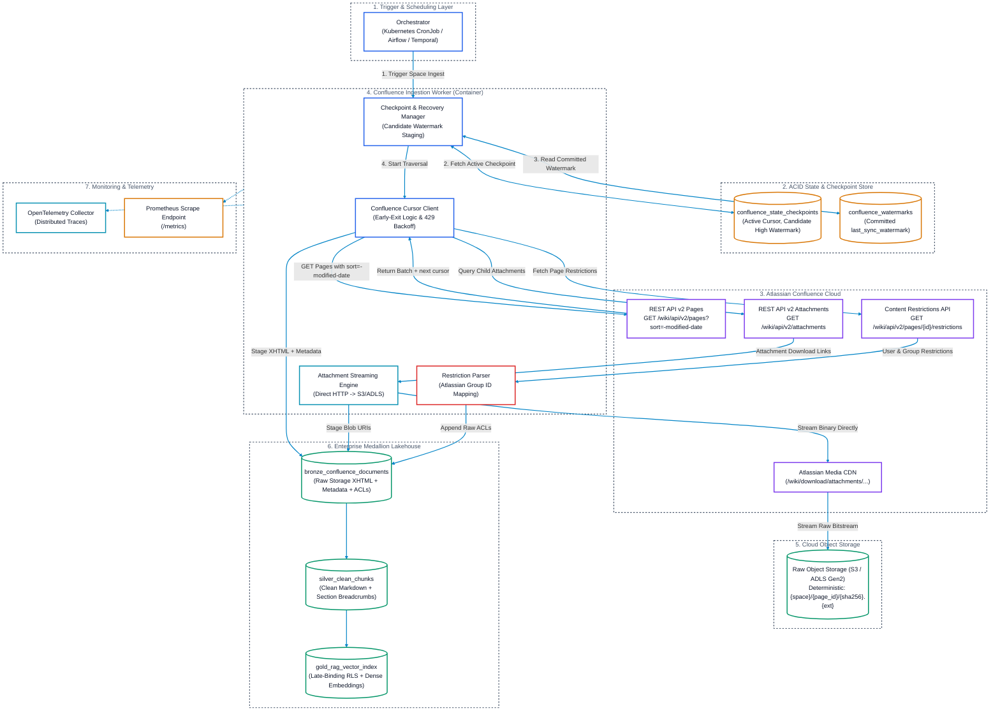
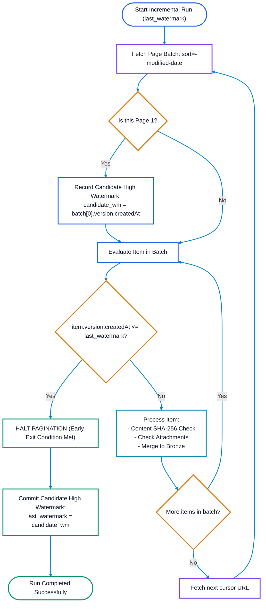
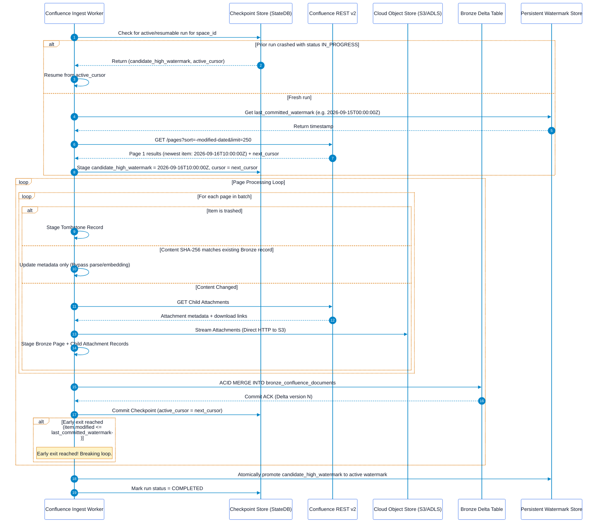

# Confluence Pull Ingestor Solution Architecture

## Executive Summary
This document defines the production solution architecture for the **Atlassian Confluence Pull Ingestor**. Designed for secure enterprise environments without public webhooks, this ingestor synchronizes Confluence Cloud and Data Center workspaces (Spaces, Pages, Blogposts, and Attachments) into an Enterprise Data Lakehouse (Delta Lake / Apache Iceberg).

The ingestor features an optimized **Descending Sort + Early-Exit** incremental pull engine, **mid-process crash recovery with zero rework**, **decoupled attachment blob streaming**, and **late-binding permission enforcement**.

---

## 1. End-to-End System Architecture



---

## 2. Confluence Incremental Pull Mechanics

Unlike Microsoft Graph (which yields a single forward delta token), Confluence incremental synchronization relies on **cursor traversal over time-ordered resources** or **CQL date queries**.

### 2.1 Primary Engine: REST API v2 Cursor Traversal
Confluence REST API v2 provides cursor-based pagination that eliminates legacy offset degradation (`start=10000`).

* **Endpoint**: `GET /wiki/api/v2/pages`
* **Query Parameters**:
  - `sort=-modified-date`: Sorts strictly from newest modified to oldest.
  - `status=current,trashed`: Captures active documents and soft-deleted documents.
  - `body-format=storage`: Fetches storage-format XHTML content.
  - `limit=250`: Optimal batch payload size.

```http
GET /wiki/api/v2/pages?sort=-modified-date&status=current,trashed&limit=250&body-format=storage HTTP/1.1
Host: your-domain.atlassian.net
Authorization: Bearer <api_token>
Accept: application/json
```

### 2.2 The Descending Sort + Early-Exit Algorithm
Because pages are ordered by `-modified-date`, the ingestor guarantees $O(\Delta)$ network requests (proportional only to changed items) without scanning the entire workspace:



### 2.3 Secondary Engine: Confluence Query Language (CQL) for Historical Backfill
For massive historical migrations across hundreds of spaces, sequential cursor traversal over a single thread creates an operational bottleneck. **CQL sliding-window queries** partition the historical space across parallel workers:

* **Endpoint**: `GET /wiki/rest/api/content/search`
* **Sliding Window Expression**:
  ```
  cql=lastModified >= "2025-01-01 00:00" AND lastModified < "2025-06-01 00:00" 
      AND status in (current, trashed) 
      AND type in (page, blogpost, attachment) 
      order by lastModified asc
  ```
* **Guardrail**: CQL searches degrade if `start > 10000`. Historical partition bounds must be sized to encompass $\le 5,000$ documents per slice.

---

## 3. Mid-Process Restart & Reliability Engine (Zero Rework)

### 3.1 The Watermark Staging Challenge in Descending Sync
Because the feed is sorted descending:
* The **newest modification** appears on **Page 1**.
* The **watermark threshold** appears on the **last page** of the crawl.

> [!CAUTION]
> **Anti-Pattern**: If an ingestor commits the newest timestamp on Page 1 as the active watermark, and crashes on Page 2, subsequent runs will assume the sync finished at Page 1's timestamp. **All changes between Page 2 and the old watermark would be permanently lost!**

### 3.2 Two-Tier Checkpoint Protocol
To guarantee complete data integrity and eliminate rework upon restart:



### 3.3 Checkpoint State Store Schema
The checkpoint state is tracked in an ACID Delta table:

```sql
CREATE TABLE IF NOT EXISTS confluence_state_checkpoints (
    tenant_id                   STRING NOT NULL,
    space_id                    STRING NOT NULL,
    run_id                      STRING NOT NULL,
    status                      STRING NOT NULL, -- 'IN_PROGRESS', 'BATCH_COMMITTED', 'COMPLETED', 'FAILED'
    candidate_high_watermark    TIMESTAMP NOT NULL,
    baseline_watermark          TIMESTAMP,
    active_cursor               STRING,          -- Cursor URL token
    items_processed_in_run      BIGINT NOT NULL DEFAULT 0,
    bytes_streamed_in_run       BIGINT NOT NULL DEFAULT 0,
    last_error_message          STRING,
    created_at                  TIMESTAMP NOT NULL,
    updated_at                  TIMESTAMP NOT NULL
) USING DELTA
PARTITIONED BY (tenant_id, space_id);
```

### 3.4 Crash Recovery Matrix

| Crash Scenario | System State | Recovery Protocol | Rework Incurred |
| :--- | :--- | :--- | :--- |
| **Crash on Page 1 before any batch commit** | Checkpoint not created or empty. | Ingestor queries persistent `confluence_watermarks` and restarts Page 1 cleanly. | Zero. |
| **Crash during Attachment Streaming** | Some attachments streamed to S3; batch not committed to Bronze. | Worker resumes at current `active_cursor`. Deterministic storage paths `{space}/{page_id}/{sha256}.{ext}` ensure already uploaded attachments are matched via `HEAD` request and skipped. | **Zero duplicate bytes transferred.** |
| **Crash between Bronze Merge and Checkpoint Commit** | Bronze table has batch; checkpoint has previous cursor. | Worker refetches the same cursor; `MERGE INTO` detects matching `(space_id, page_id, version_number)` and executes an idempotent update. | Minimal (1 API GET call; zero parsing). |
| **Pod Eviction (SIGTERM received)** | Signal trapped by process. | Worker completes the current page batch, commits cursor to `confluence_state_checkpoints`, and halts gracefully. | **Zero rework**. |

---

## 4. Attachment Ingestion & Lineage Mapping

Confluence pages frequently embed architectural diagrams, specification spreadsheets, and PDFs as attachments.

### 4.1 Child Attachment Extraction Protocol
1. For every created or modified page, query the child attachments endpoint:
   ```http
   GET /wiki/api/v2/pages/{page-id}/attachments?limit=100 HTTP/1.1
   Host: your-domain.atlassian.net
   Authorization: Bearer <api_token>
   ```
2. For each attachment:
   * Evaluate `fileSize` and `version.createdAt`.
   * Compare `content_sha256` against Lakehouse catalog.
   * If modified or new, stream binary directly from Confluence Media CDN to Cloud Object Storage:
     `abfss://lakehouse@storage.dfs.core.windows.net/raw/confluence/{tenant_id}/{space_id}/{page_id}/attachments/{attachment_id}/{content_sha256}.{ext}`
3. **Lineage Ingestion**:
   In `bronze_confluence_documents`, the attachment record stores `parent_page_id = page_id` and `entity_type = 'attachment'`. When Silver chunks are created, breadcrumbs automatically inject:
   `Space > Parent Page Title > Attachment File Name`.

---

## 5. Security, Identity & Late-Binding Access Control

### 5.1 Confluence Permission Topology
Permissions are enforced at two tiers:
1. **Space Permissions**: Space-wide access granted to user groups (e.g., `confluence-users`, `finance-dept`).
2. **Page Restrictions**: Fine-grained view or edit restrictions placed on specific pages:
   ```http
   GET /wiki/api/v2/pages/{page-id}/restrictions HTTP/1.1
   Host: your-domain.atlassian.net
   ```

### 5.2 Incremental Permission Auditing
Confluence pages do not bump `version.number` when only access restrictions change. To capture security updates incrementally:
* **Confluence Audit Log API**:
  `GET /wiki/api/v2/audit-records?startDate={last_audit_sync}`
* Filter for events:
  - `Page Restriction Added`
  - `Page Restriction Removed`
  - `Space Permissions Changed`
* **Trigger**: When an audit record is received for a `page_id`, the worker updates the `raw_acls` field in Bronze and marks the Silver record for re-normalization without re-parsing the document body.

### 5.3 Query-Time Enforcement
* Silver chunks store normalized Atlassian Account IDs and Group IDs (`allowed_group_ids: ["grp_engineering_core"]`).
* Downstream RAG vector searches filter chunks using late-binding security:
  $$\text{Query Filter: } \text{user\_atlassian\_groups} \cap \text{chunk\_allowed\_group\_ids} \neq \emptyset$$

---

## 6. Tombstones & Deletion Lifecycle

### 6.1 Soft-Delete (`status: "trashed"`)
* Captured directly by querying `status=current,trashed`.
* When `page.status == "trashed"`, Bronze appends a tombstone record:
  ```sql
  INSERT INTO bronze_confluence_documents (
      tenant_id, container_id, item_id, entity_type, is_deleted, deleted_at, ingestion_timestamp
  ) VALUES (
      'atlassian_tenant', 'ENG', '10485761', 'page', TRUE, CURRENT_TIMESTAMP(), CURRENT_TIMESTAMP()
  );
  ```
* Downstream vector indexes immediately delete vectors for `item_id = '10485761'`.

### 6.2 Permanent Purge (`removed`) & Weekly Reconciliation
When an administrator empties the trash, the page is purged from the database and will not appear in descending modified date queries.
* **Weekly Reconciliation Diff**:
  1. Once per week, a lightweight sweeper queries all active IDs in a space:
     `GET /wiki/api/v2/spaces/{id}/pages?limit=250` (projecting only `id`).
  2. The sweeper compares active IDs against the Bronze Lakehouse catalog.
  3. Lakehouse IDs missing from Confluence are marked with `is_permanently_purged = TRUE` and vectors are evicted.

---

## 7. Network Resilience & Rate Limiting

### 7.1 Atlassian Cloud Rate Limits
Atlassian Cloud enforces tenant-level token bucket limits.
* **Status Code**: `HTTP 429 Too Many Requests`.
* **Header**: `Retry-After: <seconds>`.
* Ingestors implement exponential backoff with jitter, pausing all space workers across the tenant when a `429` is received to avoid cascading lockout.

---

## 8. Observability, Logging & Monitoring

### 8.1 Prometheus Metrics Catalog

| Metric Name | Type | Labels | Description |
| :--- | :--- | :--- | :--- |
| `confluence_sync_duration_seconds` | Histogram | `tenant_id`, `space_id`, `status` | Time taken to complete a space synchronization run. |
| `confluence_pages_discovered_total` | Counter | `tenant_id`, `space_id` | Total pages and blogposts returned by API queries. |
| `confluence_attachments_streamed_total` | Counter | `tenant_id`, `space_id` | Number of binary attachments streamed to S3/ADLS. |
| `confluence_items_skipped_cache_total` | Counter | `tenant_id`, `space_id` | Items bypassed due to matching content SHA-256. |
| `confluence_tombstones_processed_total` | Counter | `tenant_id`, `space_id` | Trashed or purged pages tombstoned in Lakehouse. |
| `confluence_bytes_streamed_total` | Counter | `tenant_id`, `space_id` | Raw payload bytes transferred to cloud storage. |
| `confluence_api_requests_total` | Counter | `endpoint`, `status_code` | HTTP requests to Atlassian Confluence REST APIs. |
| `confluence_api_throttles_429_total` | Counter | `tenant_id` | Total HTTP 429 throttle events. |
| `confluence_watermark_lag_seconds` | Gauge | `tenant_id`, `space_id` | Age of latest watermark compared to `now()`. |
| `confluence_early_exits_total` | Counter | `tenant_id`, `space_id` | Count of pagination loops successfully terminated by early exit. |

### 8.2 OpenTelemetry Trace Spans
```
[Trace: confluence_sync_space]
  ├── [Span: state.get_checkpoint]
  ├── [Span: confluence.fetch_pages_batch] (attributes: page_count=250, sort="-modified-date")
  │     ├── [Span: confluence.fetch_restrictions] (attributes: page_id="10485761")
  │     ├── [Span: confluence.fetch_attachments] (attributes: page_id="10485761")
  │     │     └── [Span: blob.stream_to_adls] (attributes: attachment_id="99182", bytes=451200)
  │     └── [Span: delta.merge_bronze] (attributes: batch_size=250)
  ├── [Span: state.commit_checkpoint] (attributes: active_cursor)
  └── [Span: watermark.promote_high_watermark] (attributes: watermark="2026-09-16T10:00:00Z")
```

### 8.3 Structured JSON Audit Logging
```json
{
  "timestamp": "2026-09-16T08:35:20.892Z",
  "level": "INFO",
  "logger": "confluence_pull_ingestor",
  "trace_id": "8a4f91b0d2354c7b89ee19a7852c0041",
  "span_id": "01b8e4f5a3c91102",
  "tenant_id": "atlassian_cloud_corp",
  "space_id": "ENG",
  "run_id": "3c842b01-527e-46cf-a519-74d6f8399120",
  "event_type": "EARLY_EXIT_TRIGGERED",
  "page_id": "10485761",
  "page_modified_at": "2026-09-15T07:15:00.000Z",
  "baseline_watermark": "2026-09-15T08:00:00.000Z",
  "candidate_watermark_promoted": "2026-09-16T08:30:00.000Z",
  "pages_synced_in_run": 14,
  "duration_ms": 1240
}
```

---

## 9. Lakehouse Table Contracts & DDL

### 9.1 Bronze Delta Table DDL
```sql
CREATE TABLE IF NOT EXISTS bronze_confluence_documents (
    tenant_id               STRING NOT NULL,
    container_id            STRING NOT NULL,       -- space_key / space_id
    item_id                 STRING NOT NULL,       -- Confluence page/attachment id
    parent_page_id          STRING,                -- Populated for attachments/child pages
    entity_type             STRING NOT NULL,       -- 'page', 'blogpost', 'attachment'
    version_number          INT NOT NULL,
    title                   STRING NOT NULL,
    mime_type               STRING NOT NULL,       -- 'text/html;storage', 'application/pdf'
    raw_storage_body        STRING,                -- Storage format XHTML (for pages)
    raw_blob_uri            STRING,                -- Cloud Object URI (for attachments)
    content_sha256          STRING NOT NULL,       -- 64-char hex hash
    raw_acls                STRING,                -- JSON page restrictions & space permissions
    is_deleted              BOOLEAN NOT NULL DEFAULT FALSE,
    deleted_at              TIMESTAMP,
    source_created_at       TIMESTAMP NOT NULL,
    source_modified_at      TIMESTAMP NOT NULL,
    ingestion_timestamp     TIMESTAMP NOT NULL DEFAULT CURRENT_TIMESTAMP(),
    ingestion_run_id        STRING NOT NULL
) USING DELTA
PARTITIONED BY (tenant_id, container_id, entity_type);
```

### 9.2 Watermark State Table DDL
```sql
CREATE TABLE IF NOT EXISTS confluence_watermarks (
    tenant_id               STRING NOT NULL,
    space_id                STRING NOT NULL,
    entity_type             STRING NOT NULL,       -- 'pages', 'attachments'
    last_sync_watermark     TIMESTAMP NOT NULL,
    items_synced_total      BIGINT NOT NULL,
    last_successful_run_id  STRING NOT NULL,
    updated_at              TIMESTAMP NOT NULL
) USING DELTA
PARTITIONED BY (tenant_id, space_id);
```
