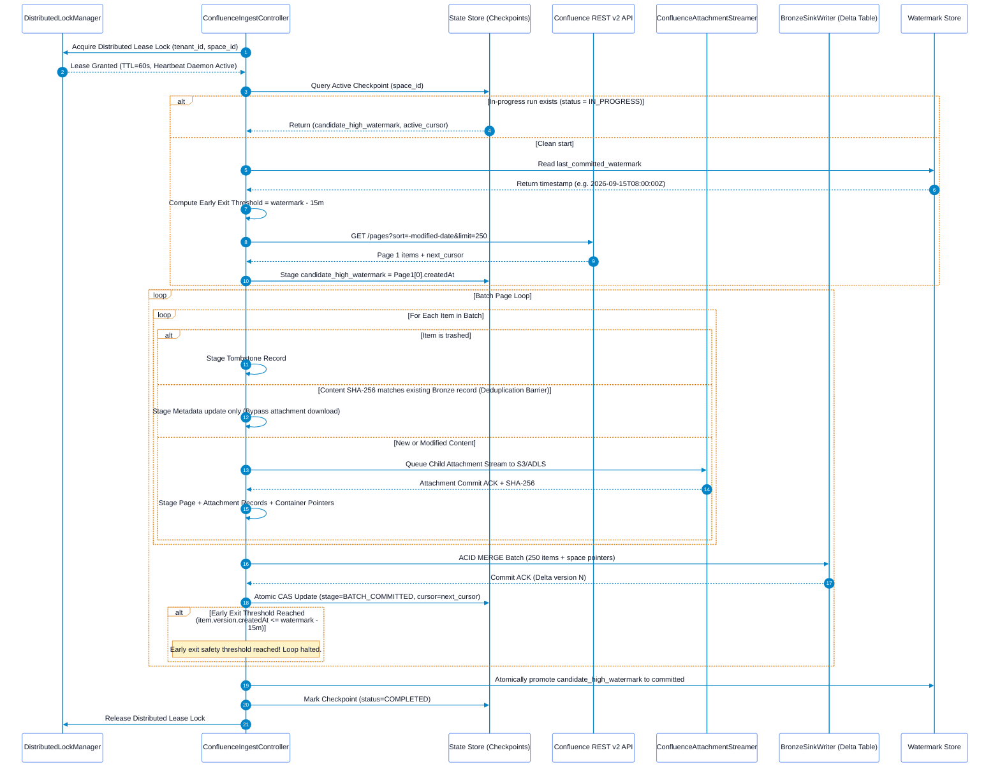

# Confluence Pull Ingestor Solution Architecture

## Executive Summary
This document specifies the solution architecture for the **Confluence Pull Ingestor**. Operating under a pure pull paradigm, this ingestor connects to Atlassian Confluence Cloud and Data Center workspaces to discover, stream, and catalog Spaces, Pages, Blogposts, and Attachments into Cloud Object Storage and Lakehouse Bronze metadata tables.

This architecture focuses strictly on the **Ingestor Component**—its internal modular subsystems, the descending sort early-exit incremental engine with a 15-minute sliding lookback window, candidate high-watermark staging for mid-process crash recovery, decoupled attachment streaming, container-level permission capture, and operational telemetry. Downstream Markdown extraction, semantic chunking, and vector indexing are decoupled and managed by downstream consumer pipelines.

---

## 1. Ingestor Component Architecture & Boundaries

The Confluence Pull Ingestor runs as a stateless container pod or standalone daemon with well-defined internal modules and boundary interfaces:

```mermaid
flowchart TD
    subgraph UpstreamAtlassian ["1. Atlassian Confluence Cloud (Upstream Source)"]
        AtlassianAuth["Atlassian Identity / OAuth2\n(Service App / Scoped Tokens)"]:::purple
        V2Pages["REST API v2 Pages & Blogs\nGET /wiki/api/v2/pages?sort=-modified-date"]:::purple
        V2Attach["REST API v2 Attachments\nGET /wiki/api/v2/attachments"]:::purple
        V2Perms["Restrictions Endpoint\nGET /wiki/api/v2/pages/{id}/restrictions"]:::purple
        MediaCDN["Atlassian Media CDN\n(/wiki/download/attachments/...)"]:::purple
    end

    subgraph StateTier ["2. ACID State & Coordination Tier"]
        StateDB[("confluence_state_checkpoints\n& confluence_watermarks")]:::amber
        LockStore[("Distributed Mutex Store\n(Redis / DB Lease Heartbeats)")]:::amber
    end

    subgraph ConfluenceIngestor ["3. Confluence Pull Ingestor Component"]
        LockMgr["DistributedLockManager\n(Lease Mutex & Run Fencing)"]:::blue
        Controller["ConfluenceIngestController\n(Run Lifecycle & SIGTERM Trapper)"]:::blue
        TokenMgr["TokenLifecycleManager\n(Proactive Auth & Scoped Secrets)"]:::cyan
        CandidateWmMgr["CandidateWatermarkManager\n(15m Sliding Lookback & CAS Coordinator)"]:::amber
        RateLimiter["AdaptiveRateLimiter\n(Token Bucket & AIMD Throttle)"]:::blue
        CursorClient["ConfluenceCursorClient\n(Early-Exit Engine & 429 Backoff)"]:::blue
        TombstoneDetector["TombstoneDetector\n(Trashed Status Detection)"]:::amber
        RestrictionParser["ConfluenceRestrictionExtractor\n(Container Hierarchy & Raw Restrictions)"]:::red
        AttachmentStreamer["ConfluenceAttachmentStreamer\n(Decoupled Worker Queue & SHA-256)"]:::cyan
        BronzeWriter["BronzeSinkWriter\n(Idempotent Delta Batch Committer)"]:::green
        Telemetry["IngestorTelemetry\n(Prometheus Metrics & OTel Traces)"]:::cyan
    end

    subgraph IngestSinks ["4. Storage & Lakehouse Sinks"]
        AttachmentStore[("Cloud Object Storage (S3 / ADLS Gen2)\nDeterministic: .../{space}/{page_id}/{sha256}.{ext}")]:::green
        BronzeTable[("Bronze Document Delta Table\n(bronze_confluence_documents)")]:::green
        SpacePermTable[("Bronze Space Perms Table\n(bronze_confluence_space_permissions)")]:::green
    end

    subgraph Observability ["5. Ingestor Observability Sinks"]
        Prom["Prometheus Collector\n(Scrapes /metrics)"]:::amber
        Otel["OpenTelemetry Collector\n(Trace Spans)"]:::cyan
        Logs["Log Aggregator\n(Structured JSON Logs)"]:::amber
    end

    %% Data Flow Transitions
    LockMgr <-->|1. Acquire / Heartbeat Lease| LockStore
    StateDB -->|2. Supply last watermark & cursor| CandidateWmMgr
    CandidateWmMgr -->|3. Feed watermark & 15m threshold| CursorClient
    TokenMgr <-->|4. Validate / Refresh Token| AtlassianAuth
    TokenMgr -.->|Supply Bearer Auth| CursorClient
    RateLimiter -.->|Enforce request tokens| CursorClient
    CursorClient <-->|5. Poll descending pages sort=-modified-date| V2Pages

    CursorClient -->|6a. Early-exit trigger / advance cursor| CandidateWmMgr
    CursorClient -->|6b. Trashed pages status=='trashed'| TombstoneDetector
    CursorClient -->|6c. Pages with restrictions| RestrictionParser
    CursorClient -->|6d. Queue child attachment downloads| AttachmentStreamer
    CursorClient -->|6e. Page body XHTML & metadata| BronzeWriter

    RestrictionParser <-->|Fetch raw restrictions| V2Perms
    AttachmentStreamer <-->|Fetch attachment metadata| V2Attach
    AttachmentStreamer <-->|Stream chunked bytes| MediaCDN

    AttachmentStreamer -->|7a. Multipart stream upload| AttachmentStore
    AttachmentStreamer -->|7b. Supply Cloud URI + SHA-256| BronzeWriter
    RestrictionParser -->|7c. Supply raw ACLs & space pointers| BronzeWriter
    RestrictionParser -->|7d. Supply space permission payload| SpacePermTable
    TombstoneDetector -->|7e. Supply tombstone records| BronzeWriter

    BronzeWriter -->|8. ACID Batch Merge| BronzeTable
    BronzeWriter -->|9. Batch committed ACK| CandidateWmMgr
    CandidateWmMgr -->|10. Atomic CAS cursor commit / promote watermark| StateDB

    %% Controller & Telemetry
    Controller -.->|Supervise run loop & trap SIGTERM| CursorClient
    Controller -.->|Trigger batch flush| BronzeWriter
    Telemetry -.-> Prom
    Telemetry -.-> Otel
    Telemetry -.-> Logs

    %% Subgraphs Styling (Bigger container has thicker border line)
    style UpstreamAtlassian fill:none,stroke:#475569,stroke-width:2px,stroke-dasharray: 4 4,color:#475569
    style StateTier fill:none,stroke:#475569,stroke-width:2px,stroke-dasharray: 4 4,color:#475569
    style ConfluenceIngestor fill:none,stroke:#2563eb,stroke-width:3.5px,stroke-dasharray: 6 3,color:#2563eb
    style IngestSinks fill:none,stroke:#475569,stroke-width:2px,stroke-dasharray: 4 4,color:#475569
    style Observability fill:none,stroke:#475569,stroke-width:2px,stroke-dasharray: 4 4,color:#475569

    %% High-Visibility Link Arrows
    linkStyle default stroke:#0284c7,stroke-width:2px

    %% Dual-Mode Card Palette
    classDef default fill:#ffffff,stroke:#475569,stroke-width:2.5px,color:#0f172a;
    classDef blue    fill:#ffffff,stroke:#2563eb,stroke-width:2.5px,color:#0f172a;
    classDef green   fill:#ffffff,stroke:#059669,stroke-width:2.5px,color:#0f172a;
    classDef amber   fill:#ffffff,stroke:#d97706,stroke-width:2.5px,color:#0f172a;
    classDef purple  fill:#ffffff,stroke:#7c3aed,stroke-width:2.5px,color:#0f172a;
    classDef red     fill:#ffffff,stroke:#dc2626,stroke-width:2.5px,color:#0f172a;
    classDef cyan    fill:#ffffff,stroke:#0891b2,stroke-width:2.5px,color:#0f172a;
```



---

## 2. Ingestor Internal Subsystems

### 2.1 `DistributedLockManager` (Concurrency & Run Fencing)
Prevents overlapping runs across identical spaces:
* **Lease Acquisition**: Before starting, the worker acquires a distributed lease lock in Redis (`SET lock:confluence:{tenant_id}:{space_id} {run_id} NX PX 60000`).
* **Heartbeat Renewal**: A daemon background thread refreshes the lease every 15 seconds while the sync cycle is active.
* **Fencing**: If another pod holds the lease, the worker halts gracefully without modifying state, preventing Delta Lake `ConcurrentAppendException` and cursor corruption.

### 2.2 `TokenLifecycleManager` (Proactive Authentication & Service Identity)
Manages Atlassian Cloud / Data Center credentials:
* **Service Account Decoupling**: Enforces dedicated Atlassian Service Accounts or OAuth 2.0 (2LO) Service App credentials, decoupling ingestion from human employee life-cycles.
* **Proactive 75% TTL Refresh**: Automatically refreshes OAuth tokens at 75% of expiration time.
* **Terminal Error Classification**: Treats `401 Unauthorized` (bad token) and `403 Forbidden` (account revoked) as terminal errors that abort execution immediately rather than looping through retries.

### 2.3 `ConfluenceIngestController` (Lifecycle & Run Orchestration)
The central orchestrator driving space synchronization:
* **Run Initialization**: Generates a unique `run_id` (UUID), acquires the distributed lease lock, initializes telemetry context, and queries `CandidateWatermarkManager` for existing checkpoints.
* **Batch Loop**: Iterates through change pages from `ConfluenceCursorClient`, queues attachments to `AttachmentStreamer`, gathers restrictions via `ConfluenceRestrictionExtractor`, and commits batches via `BronzeSinkWriter`.
* **Signal Trapping**: Intercepts POSIX `SIGTERM` and `SIGINT` (e.g. during Kubernetes pod eviction), halts subsequent page polling, flushes pending in-flight attachment streams, commits the current cursor, releases the lease, and exits cleanly with code 0.

### 2.4 `ConfluenceCursorClient` (Early-Exit Engine with 15-Minute Sliding Lookback)
Manages outbound REST requests and pagination across Confluence Cloud:
* **Primary Engine: Descending Cursor Traversal**:
  - Request format:
    ```http
    GET /wiki/api/v2/pages?sort=-modified-date&status=current,trashed&limit=250&body-format=storage HTTP/1.1
    Host: your-domain.atlassian.net
    Authorization: Bearer <api_token>
    Accept: application/json
    ```
  - Follows opaque cursor tokens from `_links.next` with $O(1)$ database efficiency.
* **15-Minute Sliding Lookback Window (Preventing Boundary Skipping)**:
  - To prevent silent data loss caused by sub-second timestamp truncation in Atlassian APIs and cross-region replica lag, the early-exit condition is offset:
    $$\text{Early Exit Threshold} = \text{last\_committed\_watermark} - \Delta_{\text{lookback}} \quad (\Delta_{\text{lookback}} = 15\text{ minutes})$$
  - Pagination halts only when:
    $$\text{item.version.createdAt} \le \text{Early Exit Threshold}$$
* **Content Checksum Deduplication Barrier**:
  - All items encountered within the 15-minute overlap window are checked against their stored `content_sha256`. If unchanged, binary downloads and downstream writes are bypassed as zero-cost no-ops.

### 2.5 `CandidateWatermarkManager` (Mid-Process Restart & CAS Engine)
Solves the descending pagination dilemma:
* **The Problem**: In descending crawls, the highest (newest) timestamp is discovered on Page 1, but cannot be committed as the active watermark until all pages down to the safety threshold are successfully ingested.
* **The Solution**: 
  - On Page 1, the candidate watermark is recorded in memory and staged in `confluence_state_checkpoints`.
  - For each intermediate page, the active cursor (`_links.next`) is committed using optimistic CAS (`WHERE run_id = :run_id AND status = 'IN_PROGRESS'`).
  - Only when the early-exit threshold is reached is `candidate_high_watermark` atomically promoted to the persistent `confluence_watermarks` table.

### 2.6 `ConfluenceAttachmentStreamer` (Decoupled Rate-Governed Queue)
Eliminates the $O(N)$ fan-out explosion:
* **Decoupled Asynchronous Queue**: Page discovery and attachment downloading are decoupled. Modified pages push download tasks into an internal rate-governed queue rather than blocking the page loop.
* **Zero-RAM Streaming**: Streams raw bitstreams directly from Atlassian Media CDN to Cloud Object Storage (`s3://` or `abfss://`) in 4MB chunks.
* **Streaming Checksum**: Computes `SHA-256` on the fly as chunks transit through the worker buffer.
* **Lineage Preservation**: Tags attachment metadata with `parent_page_id`, preserving structural hierarchy.

### 2.7 `ConfluenceRestrictionExtractor` (Container Inheritance Pointer Model)
Preserves native Confluence access rules and eliminates permission drift:
* **Container-Level Pointer Architecture**:
  - Pages record `parent_page_id`, `space_id`, and `has_unique_restrictions: BOOLEAN`.
  - For pages inheriting restrictions, `inherited_from_space_id = space_id`.
* **Companion Space Permissions Table**: Space-level permission schemes are synced to `bronze_confluence_space_permissions`.
* **Late-Binding Query Security**: Downstream Silver/Gold search engines join page documents with their parent restrictions and space permissions dynamically at query time. Modifying space permissions reflects immediately without needing full space re-crawls.

### 2.8 `TombstoneDetector` (Deletion Detection)
* Detects soft-deleted pages where `status == "trashed"`.
* Emits tombstone records (`is_deleted = TRUE`, `deleted_at = CURRENT_TIMESTAMP`) into Bronze.

### 2.9 `BronzeSinkWriter` (Idempotent Metadata Sinking)
* Merges page and attachment batches into `bronze_confluence_documents`.
* Uses primary key `(tenant_id, container_id, item_id, version_number)` to guarantee that retrying an interrupted batch produces zero duplicate records.

---

## 3. Mid-Process Restart & Reliability Engine (Zero Rework)



### 3.1 Crash Recovery Matrix

| Crash Scenario | System State at Crash | Ingestor Action on Restart | Rework Incurred |
| :--- | :--- | :--- | :--- |
| **Crash during Attachment Streaming** | Some attachments written to storage; batch not merged into Bronze. | Ingestor re-reads current `active_cursor`. For each attachment, deterministic path `{space}/{page_id}/{sha256}.{ext}` is checked via `HEAD`. If already present, streaming is bypassed. | **Zero duplicate bytes transferred.** |
| **Crash during Bronze Merge** | Delta Lake transaction rolled back automatically by ACID engine. | Ingestor re-fetches the same cursor; batch is re-merged cleanly. | **Zero duplicate records created.** |
| **Crash between Bronze Merge and Checkpoint Commit** | Bronze has records; checkpoint still points to previous cursor. | Ingestor re-reads the page; `MERGE INTO` detects existing `(item_id, version_number)` and executes an idempotent no-op. | Minimal (1 Confluence GET call; zero re-downloads). |
| **Overlapping Run Spawned by Scheduler** | Slow run collides with scheduled CronJob. | Second worker fails to acquire distributed lease lock and exits cleanly without modifying state. | **Zero split-brain / zero lock conflict.** |
| **Graceful Preemption (SIGTERM)** | Kubernetes sends termination signal to worker pod. | `ConfluenceIngestController` finishes active item, writes checkpoint, releases lease, and halts. | **Zero rework.** |

---

## 4. Network Resilience & Adaptive Rate-Limiting Engine

Atlassian Cloud enforces tenant-level and user-level token bucket limits (~200–400 requests/minute on Standard/Premium tiers).

### 4.1 Distributed Token Bucket & Adaptive Concurrency Control (AIMD)
The ingestor uses an AIMD engine with full decorrelated jitter and `Retry-After` compliance:

```python
import time
import random
import logging
import requests

class ResilientConfluenceClient:
    def __init__(self, tenant_id: str, max_concurrency: int = 8, min_concurrency: int = 1):
        self.tenant_id = tenant_id
        self.current_concurrency = max_concurrency
        self.min_concurrency = min_concurrency
        self.max_concurrency = max_concurrency
        self.last_success_time = time.time()

    def execute_request(self, url: str, headers: dict, max_retries: int = 5) -> requests.Response:
        attempt = 0
        base_sleep = 2.0

        while attempt < max_retries:
            resp = requests.get(url, headers=headers, timeout=30)

            # Detect Throttling and Gateway Degradation
            if resp.status_code in (429, 503, 504):
                attempt += 1
                # Multiplicative Decrease: Slash concurrency by 50%
                self.current_concurrency = max(self.min_concurrency, self.current_concurrency // 2)

                retry_after = resp.headers.get("Retry-After")
                if retry_after:
                    backoff = float(retry_after)
                else:
                    backoff = min(90.0, base_sleep * (2 ** attempt))

                # Full Decorrelated Jitter
                jittered_backoff = backoff + random.uniform(0.5, 2.0)
                logging.warning(
                    f"Confluence throttled ({resp.status_code}). Slashed concurrency to {self.current_concurrency}. "
                    f"Backing off {jittered_backoff:.2f}s (Attempt {attempt}/{max_retries})"
                )
                time.sleep(jittered_backoff)
                continue

            # Terminal Authentication Errors
            if resp.status_code in (401, 403):
                logging.error(f"Unrecoverable auth failure ({resp.status_code}): {resp.text}")
                resp.raise_for_status()

            resp.raise_for_status()

            # Additive Increase: Increment concurrency every 60s of stable execution
            if time.time() - self.last_success_time > 60.0:
                self.current_concurrency = min(self.max_concurrency, self.current_concurrency + 1)
                self.last_success_time = time.time()

            return resp

        raise RuntimeError(f"Exceeded max retries ({max_retries}) for Confluence API: {url}")
```

---

## 5. Ingestor Observability & Telemetry

### 5.1 Prometheus Metrics Catalog

| Metric Name | Type | Labels | Description |
| :--- | :--- | :--- | :--- |
| `confluence_sync_duration_seconds` | Histogram | `tenant_id`, `space_id`, `status` | Total duration of a space synchronization run. |
| `confluence_pages_discovered_total` | Counter | `tenant_id`, `space_id` | Total pages and blogposts returned by API queries. |
| `confluence_attachments_streamed_total` | Counter | `tenant_id`, `space_id` | Count of binary attachments streamed to object storage. |
| `confluence_items_skipped_cache_total` | Counter | `tenant_id`, `space_id` | Items bypassed due to matching content SHA-256 (Deduplication barrier). |
| `confluence_tombstones_processed_total` | Counter | `tenant_id`, `space_id` | Trashed or purged pages tombstoned in Lakehouse. |
| `confluence_bytes_streamed_total` | Counter | `tenant_id`, `space_id` | Raw payload bytes transferred to cloud storage. |
| `confluence_api_requests_total` | Counter | `endpoint`, `status_code` | HTTP requests to Atlassian Confluence REST APIs. |
| `confluence_api_throttles_429_total` | Counter | `tenant_id` | Count of HTTP 429 throttle responses encountered. |
| `confluence_concurrency_threads` | Gauge | `tenant_id`, `space_id` | Active worker concurrency governed by AIMD throttler. |
| `confluence_lock_acquisitions_total` | Counter | `tenant_id`, `space_id`, `status` | Count of distributed lease lock acquisition attempts. |
| `confluence_watermark_lag_seconds` | Gauge | `tenant_id`, `space_id` | Time delta between `now()` and timestamp of last successful sync. |
| `confluence_early_exits_total` | Counter | `tenant_id`, `space_id` | Count of pagination loops successfully terminated by early exit. |

### 5.2 OpenTelemetry Distributed Tracing
```
[Trace: confluence_sync_space]
  ├── [Span: lock.acquire_lease] (attributes: lease_ttl=60s)
  ├── [Span: token.validate_credentials]
  ├── [Span: checkpoint.get_active_cursor]
  ├── [Span: confluence.fetch_pages_batch] (attributes: limit=250, sort="-modified-date")
  │     ├── [Span: confluence.fetch_restrictions] (attributes: page_id="10485761")
  │     ├── [Span: queue.enqueue_attachment] (attributes: page_id="10485761", count=2)
  │     │     └── [Span: blob.stream_to_storage] (attributes: attachment_id="99182", bytes=451200)
  │     └── [Span: bronze.acid_merge_batch] (attributes: batch_size=250)
  ├── [Span: checkpoint.cas_commit_batch] (attributes: committed_cursor)
  ├── [Span: watermark.promote_high_watermark] (attributes: watermark="2026-09-16T10:00:00Z")
  └── [Span: lock.release_lease]
```

### 5.3 Structured JSON Audit Logging
```json
{
  "timestamp": "2026-09-16T08:35:20.892Z",
  "level": "INFO",
  "logger": "confluence_pull_ingestor",
  "trace_id": "8a4f91b0d2354c7b89ee19a7852c0041",
  "span_id": "01b8e4f5a3c91102",
  "tenant_id": "atlassian_cloud_corp",
  "space_id": "ENG",
  "run_id": "3c842b01-527e-46cf-a519-74d6f8399120",
  "event_type": "EARLY_EXIT_TRIGGERED",
  "page_id": "10485761",
  "page_modified_at": "2026-09-15T07:15:00.000Z",
  "baseline_watermark": "2026-09-15T08:00:00.000Z",
  "lookback_threshold": "2026-09-15T07:45:00.000Z",
  "candidate_watermark_promoted": "2026-09-16T08:30:00.000Z",
  "pages_synced_in_run": 14,
  "duration_ms": 1240
}
```

---

## 6. External Data Contracts & Table DDL

### 6.1 Bronze Document Metadata Table DDL (`bronze_confluence_documents`)
```sql
CREATE TABLE IF NOT EXISTS bronze_confluence_documents (
    tenant_id                   STRING NOT NULL,
    container_id                STRING NOT NULL,       -- space_key / space_id
    item_id                     STRING NOT NULL,       -- Confluence page/attachment id
    parent_page_id              STRING,                -- Populated for attachments/child pages
    inherited_from_space_id     STRING,                -- Space ID governing default permissions
    has_unique_restrictions     BOOLEAN NOT NULL DEFAULT FALSE,
    entity_type                 STRING NOT NULL,       -- 'page', 'blogpost', 'attachment'
    version_number              INT NOT NULL,
    title                       STRING NOT NULL,
    mime_type                   STRING NOT NULL,       -- 'text/html;storage', 'application/pdf'
    raw_storage_body            STRING,                -- Storage format XHTML (for pages)
    raw_blob_uri                STRING,                -- Cloud Object URI (for attachments)
    content_sha256              STRING NOT NULL,       -- 64-char hex hash
    raw_acls                    STRING,                -- JSON page restrictions (if unique)
    is_deleted                  BOOLEAN NOT NULL DEFAULT FALSE,
    deleted_at                  TIMESTAMP,
    source_created_at           TIMESTAMP NOT NULL,
    source_modified_at          TIMESTAMP NOT NULL,
    ingestion_timestamp         TIMESTAMP NOT NULL DEFAULT CURRENT_TIMESTAMP(),
    ingestion_run_id            STRING NOT NULL
) USING DELTA
PARTITIONED BY (tenant_id, container_id, entity_type);
```

### 6.2 Bronze Space Permissions Table DDL (`bronze_confluence_space_permissions`)
```sql
CREATE TABLE IF NOT EXISTS bronze_confluence_space_permissions (
    tenant_id               STRING NOT NULL,
    space_id                STRING NOT NULL,           -- space_key / space_id
    raw_space_acls          STRING NOT NULL,           -- Untouched JSON space permission scheme
    sync_timestamp          TIMESTAMP NOT NULL DEFAULT CURRENT_TIMESTAMP(),
    ingestion_run_id        STRING NOT NULL
) USING DELTA
PARTITIONED BY (tenant_id, space_id);
```

### 6.3 Checkpoint State Store DDL (`confluence_state_checkpoints`)
```sql
CREATE TABLE IF NOT EXISTS confluence_state_checkpoints (
    tenant_id                   STRING NOT NULL,
    space_id                    STRING NOT NULL,
    run_id                      STRING NOT NULL,
    status                      STRING NOT NULL, -- 'IN_PROGRESS', 'BATCH_COMMITTED', 'COMPLETED', 'FAILED'
    candidate_high_watermark    TIMESTAMP NOT NULL,
    baseline_watermark          TIMESTAMP,
    active_cursor               STRING,          -- Cursor URL token
    items_processed_in_run      BIGINT NOT NULL DEFAULT 0,
    bytes_streamed_in_run       BIGINT NOT NULL DEFAULT 0,
    last_error_message          STRING,
    created_at                  TIMESTAMP NOT NULL,
    updated_at                  TIMESTAMP NOT NULL
) USING DELTA
PARTITIONED BY (tenant_id, space_id);
```
