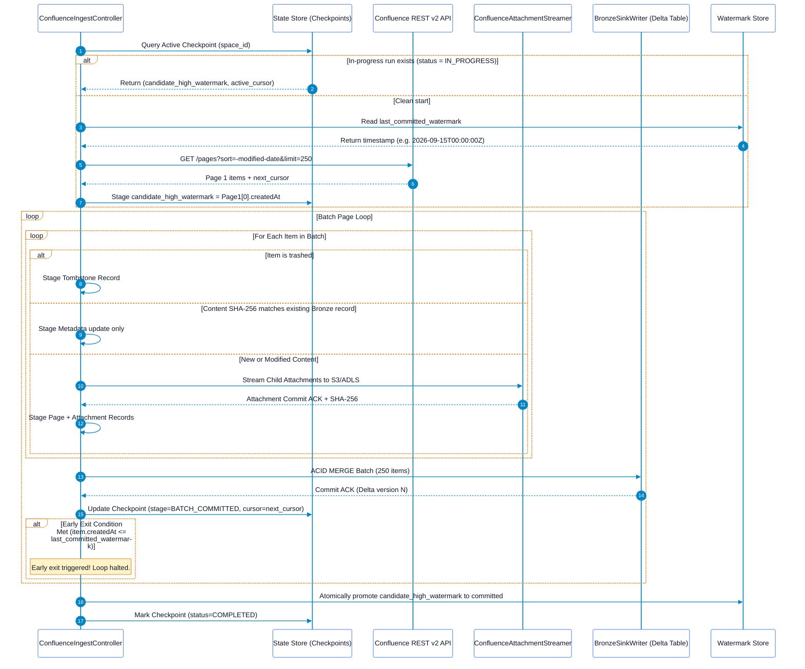

# Confluence Pull Ingestor Solution Architecture

## Executive Summary
This document specifies the solution architecture for the **Confluence Pull Ingestor**. Operating under a pure pull paradigm, this ingestor connects to Atlassian Confluence Cloud and Data Center workspaces to discover, stream, and catalog Spaces, Pages, Blogposts, and Attachments into Cloud Object Storage and Lakehouse Bronze metadata tables.

This architecture focuses strictly on the **Ingestor Component**—its internal modular subsystems, the descending sort early-exit incremental engine, candidate high-watermark staging for mid-process crash recovery, decoupled attachment streaming, raw permission capture, and operational telemetry. Downstream Markdown extraction, semantic chunking, and vector indexing are decoupled and managed by downstream consumer pipelines.

---

## 1. Ingestor Component Architecture & Boundaries

The Confluence Pull Ingestor runs as a stateless container pod or standalone daemon with well-defined internal modules and boundary interfaces:

```mermaid
flowchart TD
    subgraph UpstreamAtlassian ["1. Atlassian Confluence Cloud (Upstream Source)"]
        V2Pages["REST API v2 Pages & Blogs\nGET /wiki/api/v2/pages?sort=-modified-date"]:::purple
        V2Attach["REST API v2 Attachments\nGET /wiki/api/v2/attachments"]:::purple
        V2Perms["Restrictions Endpoint\nGET /wiki/api/v2/pages/{id}/restrictions"]:::purple
        MediaCDN["Atlassian Media CDN\n(/wiki/download/attachments/...)"]:::purple
    end

    subgraph StateTier ["2. ACID State Store"]
        StateDB[("confluence_state_checkpoints\n& confluence_watermarks")]:::amber
    end

    subgraph ConfluenceIngestor ["3. Confluence Pull Ingestor Component"]
        Controller["ConfluenceIngestController\n(Run Lifecycle & SIGTERM Trapper)"]:::blue
        CandidateWmMgr["CandidateWatermarkManager\n(Watermark & Cursor Coordinator)"]:::amber
        CursorClient["ConfluenceCursorClient\n(Early-Exit Engine & 429 Backoff)"]:::blue
        TombstoneDetector["TombstoneDetector\n(Trashed Status Detection)"]:::amber
        RestrictionParser["ConfluenceRestrictionExtractor\n(Page Restrictions & Space Perms)"]:::red
        AttachmentStreamer["ConfluenceAttachmentStreamer\n(Zero-RAM HTTP -> S3/ADLS & SHA-256)"]:::cyan
        BronzeWriter["BronzeSinkWriter\n(Idempotent Delta Batch Committer)"]:::green
        Telemetry["IngestorTelemetry\n(Prometheus Metrics & OTel Traces)"]:::cyan
    end

    subgraph IngestSinks ["4. Storage & Lakehouse Sinks"]
        AttachmentStore[("Cloud Object Storage (S3 / ADLS Gen2)\nDeterministic: .../{space}/{page_id}/{sha256}.{ext}")]:::green
        BronzeTable[("Bronze Metadata Delta Table\n(bronze_confluence_documents)")]:::green
    end

    subgraph Observability ["5. Ingestor Observability Sinks"]
        Prom["Prometheus Collector\n(Scrapes /metrics)"]:::amber
        Otel["OpenTelemetry Collector\n(Trace Spans)"]:::cyan
        Logs["Log Aggregator\n(Structured JSON Logs)"]:::amber
    end

    %% Data Flow Transitions
    StateDB -->|1. Supply last watermark & cursor| CandidateWmMgr
    CandidateWmMgr -->|2. Feed watermark & cursor| CursorClient
    CursorClient <-->|3. Poll descending pages sort=-modified-date| V2Pages

    CursorClient -->|4a. Early-exit trigger / advance cursor| CandidateWmMgr
    CursorClient -->|4b. Trashed pages status=='trashed'| TombstoneDetector
    CursorClient -->|4c. Pages with restrictions| RestrictionParser
    CursorClient -->|4d. Pages with child attachments| AttachmentStreamer
    CursorClient -->|4e. Page body XHTML & metadata| BronzeWriter

    RestrictionParser <-->|Fetch raw restrictions| V2Perms
    AttachmentStreamer <-->|Fetch attachment metadata| V2Attach
    AttachmentStreamer <-->|Stream chunked bytes| MediaCDN

    AttachmentStreamer -->|5a. Multipart stream upload| AttachmentStore
    AttachmentStreamer -->|5b. Supply Cloud URI + SHA-256 + Lineage| BronzeWriter
    RestrictionParser -->|5c. Supply raw ACL payloads| BronzeWriter
    TombstoneDetector -->|5d. Supply tombstone records| BronzeWriter

    BronzeWriter -->|6. ACID Batch Merge| BronzeTable
    BronzeWriter -->|7. Batch committed ACK| CandidateWmMgr
    CandidateWmMgr -->|8. Commit cursor / promote candidate watermark| StateDB

    %% Controller & Telemetry
    Controller -.->|Supervise run loop & trap SIGTERM| CursorClient
    Controller -.->|Trigger batch flush| BronzeWriter
    Telemetry -.-> Prom
    Telemetry -.-> Otel
    Telemetry -.-> Logs

    %% Subgraphs Styling
    style UpstreamAtlassian fill:none,stroke:#475569,stroke-width:2px,stroke-dasharray: 4 4,color:#475569
    style StateTier fill:none,stroke:#475569,stroke-width:2px,stroke-dasharray: 4 4,color:#475569
    style ConfluenceIngestor fill:none,stroke:#475569,stroke-width:2px,stroke-dasharray: 4 4,color:#475569
    style IngestSinks fill:none,stroke:#475569,stroke-width:2px,stroke-dasharray: 4 4,color:#475569
    style Observability fill:none,stroke:#475569,stroke-width:2px,stroke-dasharray: 4 4,color:#475569

    %% High-Visibility Link Arrows
    linkStyle default stroke:#0284c7,stroke-width:2px

    %% Dual-Mode Card Palette
    classDef default fill:#ffffff,stroke:#475569,stroke-width:2.5px,color:#0f172a;
    classDef blue    fill:#ffffff,stroke:#2563eb,stroke-width:2.5px,color:#0f172a;
    classDef green   fill:#ffffff,stroke:#059669,stroke-width:2.5px,color:#0f172a;
    classDef amber   fill:#ffffff,stroke:#d97706,stroke-width:2.5px,color:#0f172a;
    classDef purple  fill:#ffffff,stroke:#7c3aed,stroke-width:2.5px,color:#0f172a;
    classDef red     fill:#ffffff,stroke:#dc2626,stroke-width:2.5px,color:#0f172a;
    classDef cyan    fill:#ffffff,stroke:#0891b2,stroke-width:2.5px,color:#0f172a;
```



---

## 2. Ingestor Internal Subsystems

### 2.1 `ConfluenceIngestController` (Lifecycle & Run Orchestration)
The central orchestrator driving space synchronization:
* **Run Initialization**: Generates a unique `run_id` (UUID), initializes telemetry context, and queries the `CandidateWatermarkManager` for existing checkpoints.
* **Batch Loop**: Iterates through change pages from `ConfluenceCursorClient`, invokes `AttachmentStreamer` for attached files, gathers permissions via `ConfluenceRestrictionExtractor`, and commits batches via `BronzeSinkWriter`.
* **Signal Trapping**: Intercepts POSIX `SIGTERM` and `SIGINT` (e.g. during Kubernetes pod eviction), halts subsequent page polling, flushes pending in-flight attachment streams, commits the current cursor, and exits cleanly with code 0.

### 2.2 `ConfluenceCursorClient` (Early-Exit Incremental Engine)
Manages outbound REST requests and pagination across Confluence Cloud:
* **Primary Engine: Descending Cursor Traversal**:
  - Request format:
    ```http
    GET /wiki/api/v2/pages?sort=-modified-date&status=current,trashed&limit=250&body-format=storage HTTP/1.1
    Host: your-domain.atlassian.net
    Authorization: Bearer <api_token>
    Accept: application/json
    ```
  - Follows opaque cursor tokens from `_links.next` with $O(1)$ database efficiency.
* **The Descending Early-Exit Condition**:
  - Because results are sorted descending (`-modified-date`), the newest edits appear on Page 1.
  - When `page.version.createdAt <= last_sync_watermark`, the client **immediately halts pagination**. All subsequent pages are guaranteed to be older, eliminating brute-force scans.
* **Secondary Engine: CQL Sliding-Window Search**:
  - Used for parallel multi-space historical backfills:
    `cql=lastModified >= "2025-01-01 00:00" AND lastModified < "2025-06-01 00:00" AND status in (current, trashed)`
  - Bounded temporal slicing avoids the legacy 10,000 offset degradation.

### 2.3 `CandidateWatermarkManager` (Mid-Process Restart Engine)
Solves the descending pagination dilemma:
* **The Problem**: In descending crawls, the highest (newest) timestamp is discovered on Page 1, but cannot be committed as the active watermark until all pages down to the previous watermark are successfully ingested.
* **The Solution**: 
  - On Page 1, the candidate watermark is recorded in memory and staged in `confluence_state_checkpoints`.
  - For each intermediate page, the active cursor (`_links.next`) is committed to the checkpoint store.
  - Only when the early-exit condition or end-of-feed is reached is `candidate_high_watermark` atomically promoted to the persistent `confluence_watermarks` table.

### 2.4 `ConfluenceAttachmentStreamer` (Direct Zero-Buffer Streaming)
Streams page attachments directly into Cloud Storage:
* **Child Attachment Discovery**: Queries child attachments for modified pages (`GET /wiki/api/v2/pages/{id}/attachments`).
* **Zero-RAM Streaming**: Streams raw bitstreams directly from Atlassian Media CDN to Cloud Object Storage (`s3://` or `abfss://`) in 4MB chunks.
* **Streaming Checksum**: Computes `SHA-256` on the fly as chunks transit through the worker buffer.
* **Lineage Preservation**: Tags attachment metadata with `parent_page_id`, preserving structural hierarchy.

### 2.5 `ConfluenceRestrictionExtractor` (Raw Permission Capture)
Preserves native Confluence access rules untouched:
* **Page Restrictions**: Queries `/wiki/api/v2/pages/{page-id}/restrictions` for explicit read/edit user and group restrictions.
* **Space Permissions**: Extracts space-level permission schemes.
* **Raw Preservation**: Writes raw JSON permission payloads directly to the `raw_acls` column in Bronze without premature flattening.

### 2.6 `TombstoneDetector` (Deletion Detection)
* Detects soft-deleted pages where `status == "trashed"`.
* Emits tombstone records (`is_deleted = TRUE`, `deleted_at = CURRENT_TIMESTAMP`) into Bronze.

### 2.7 `BronzeSinkWriter` (Idempotent Metadata Sinking)
* Merges page and attachment batches into `bronze_confluence_documents`.
* Uses primary key `(tenant_id, container_id, item_id, version_number)` to guarantee that retrying an interrupted batch produces zero duplicate records.

---

## 3. Mid-Process Restart & Reliability Engine (Zero Rework)



### 3.1 Crash Recovery Matrix

| Crash Scenario | System State at Crash | Ingestor Action on Restart | Rework Incurred |
| :--- | :--- | :--- | :--- |
| **Crash during Attachment Streaming** | Some attachments written to storage; batch not merged into Bronze. | Ingestor re-reads current `active_cursor`. For each attachment, deterministic path `{space}/{page_id}/{sha256}.{ext}` is checked via `HEAD`. If already present, streaming is bypassed. | **Zero duplicate bytes transferred.** |
| **Crash during Bronze Merge** | Delta Lake transaction rolled back automatically by ACID engine. | Ingestor re-fetches the same cursor; batch is re-merged cleanly. | **Zero duplicate records created.** |
| **Crash between Bronze Merge and Checkpoint Commit** | Bronze has records; checkpoint still points to previous cursor. | Ingestor re-reads the page; `MERGE INTO` detects existing `(item_id, version_number)` and executes an idempotent no-op. | Minimal (1 Confluence GET call; zero re-downloads). |
| **Graceful Preemption (SIGTERM)** | Kubernetes sends termination signal to worker pod. | `ConfluenceIngestController` finishes active item, writes checkpoint, and halts. | **Zero rework.** |

---

## 4. Network Resilience & Rate-Limiting Engine

### 4.1 Atlassian Cloud Rate Limits
Atlassian Cloud enforces tenant-level token bucket limits.
* **HTTP 429 Status**: Atlassian responds with `429 Too Many Requests`.
* **`Retry-After` Header**: Specifies wait time in seconds.
* **Worker Backoff**: The ingestor pauses requests with exponential jitter:
  $$\text{Sleep Time} = \max(\text{Retry-After}, \text{base} \cdot 2^{\text{attempt}}) + \text{jitter}(0, 1)$$

---

## 5. Ingestor Observability & Telemetry

### 5.1 Prometheus Metrics Catalog

| Metric Name | Type | Labels | Description |
| :--- | :--- | :--- | :--- |
| `confluence_sync_duration_seconds` | Histogram | `tenant_id`, `space_id`, `status` | Total duration of a space synchronization run. |
| `confluence_pages_discovered_total` | Counter | `tenant_id`, `space_id` | Total pages and blogposts returned by API queries. |
| `confluence_attachments_streamed_total` | Counter | `tenant_id`, `space_id` | Count of binary attachments streamed to object storage. |
| `confluence_items_skipped_cache_total` | Counter | `tenant_id`, `space_id` | Items bypassed due to matching content SHA-256. |
| `confluence_tombstones_processed_total` | Counter | `tenant_id`, `space_id` | Trashed or purged pages tombstoned in Lakehouse. |
| `confluence_bytes_streamed_total` | Counter | `tenant_id`, `space_id` | Raw payload bytes transferred to cloud storage. |
| `confluence_api_requests_total` | Counter | `endpoint`, `status_code` | HTTP requests to Atlassian Confluence REST APIs. |
| `confluence_api_throttles_429_total` | Counter | `tenant_id` | Count of HTTP 429 throttle responses encountered. |
| `confluence_watermark_lag_seconds` | Gauge | `tenant_id`, `space_id` | Time delta between `now()` and timestamp of last successful sync. |
| `confluence_early_exits_total` | Counter | `tenant_id`, `space_id` | Count of pagination loops successfully terminated by early exit. |

### 5.2 OpenTelemetry Distributed Tracing
```
[Trace: confluence_sync_space]
  ├── [Span: checkpoint.get_active_cursor]
  ├── [Span: confluence.fetch_pages_batch] (attributes: limit=250, sort="-modified-date")
  │     ├── [Span: confluence.fetch_restrictions] (attributes: page_id="10485761")
  │     ├── [Span: confluence.fetch_attachments] (attributes: page_id="10485761")
  │     │     └── [Span: blob.stream_to_storage] (attributes: attachment_id="99182", bytes=451200)
  │     └── [Span: bronze.acid_merge_batch] (attributes: batch_size=250)
  ├── [Span: checkpoint.commit_batch] (attributes: committed_cursor)
  └── [Span: watermark.promote_high_watermark] (attributes: watermark="2026-09-16T10:00:00Z")
```

### 5.3 Structured JSON Audit Logging
```json
{
  "timestamp": "2026-09-16T08:35:20.892Z",
  "level": "INFO",
  "logger": "confluence_pull_ingestor",
  "trace_id": "8a4f91b0d2354c7b89ee19a7852c0041",
  "span_id": "01b8e4f5a3c91102",
  "tenant_id": "atlassian_cloud_corp",
  "space_id": "ENG",
  "run_id": "3c842b01-527e-46cf-a519-74d6f8399120",
  "event_type": "EARLY_EXIT_TRIGGERED",
  "page_id": "10485761",
  "page_modified_at": "2026-09-15T07:15:00.000Z",
  "baseline_watermark": "2026-09-15T08:00:00.000Z",
  "candidate_watermark_promoted": "2026-09-16T08:30:00.000Z",
  "pages_synced_in_run": 14,
  "duration_ms": 1240
}
```

---

## 6. External Data Contracts & Table DDL

### 6.1 Bronze Delta Table DDL (`bronze_confluence_documents`)
```sql
CREATE TABLE IF NOT EXISTS bronze_confluence_documents (
    tenant_id               STRING NOT NULL,
    container_id            STRING NOT NULL,       -- space_key / space_id
    item_id                 STRING NOT NULL,       -- Confluence page/attachment id
    parent_page_id          STRING,                -- Populated for attachments/child pages
    entity_type             STRING NOT NULL,       -- 'page', 'blogpost', 'attachment'
    version_number          INT NOT NULL,
    title                   STRING NOT NULL,
    mime_type               STRING NOT NULL,       -- 'text/html;storage', 'application/pdf'
    raw_storage_body        STRING,                -- Storage format XHTML (for pages)
    raw_blob_uri            STRING,                -- Cloud Object URI (for attachments)
    content_sha256          STRING NOT NULL,       -- 64-char hex hash
    raw_acls                STRING,                -- JSON page restrictions & space permissions
    is_deleted              BOOLEAN NOT NULL DEFAULT FALSE,
    deleted_at              TIMESTAMP,
    source_created_at       TIMESTAMP NOT NULL,
    source_modified_at      TIMESTAMP NOT NULL,
    ingestion_timestamp     TIMESTAMP NOT NULL DEFAULT CURRENT_TIMESTAMP(),
    ingestion_run_id        STRING NOT NULL
) USING DELTA
PARTITIONED BY (tenant_id, container_id, entity_type);
```

### 6.2 Checkpoint State Store DDL (`confluence_state_checkpoints`)
```sql
CREATE TABLE IF NOT EXISTS confluence_state_checkpoints (
    tenant_id                   STRING NOT NULL,
    space_id                    STRING NOT NULL,
    run_id                      STRING NOT NULL,
    status                      STRING NOT NULL, -- 'IN_PROGRESS', 'BATCH_COMMITTED', 'COMPLETED', 'FAILED'
    candidate_high_watermark    TIMESTAMP NOT NULL,
    baseline_watermark          TIMESTAMP,
    active_cursor               STRING,          -- Cursor URL token
    items_processed_in_run      BIGINT NOT NULL DEFAULT 0,
    bytes_streamed_in_run       BIGINT NOT NULL DEFAULT 0,
    last_error_message          STRING,
    created_at                  TIMESTAMP NOT NULL,
    updated_at                  TIMESTAMP NOT NULL
) USING DELTA
PARTITIONED BY (tenant_id, space_id);
```
