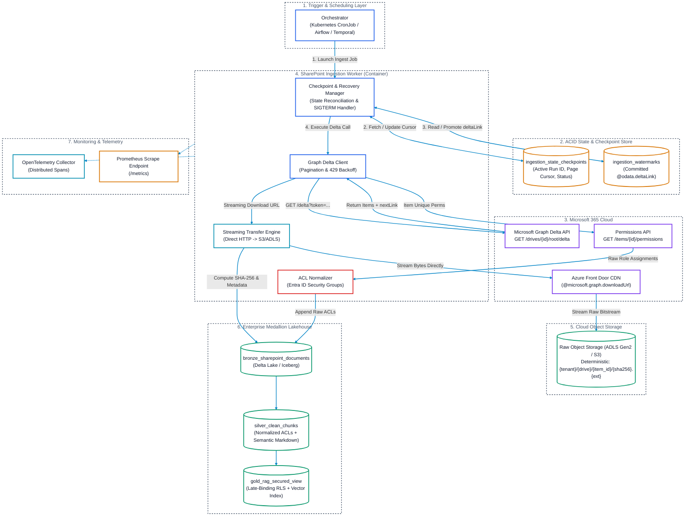
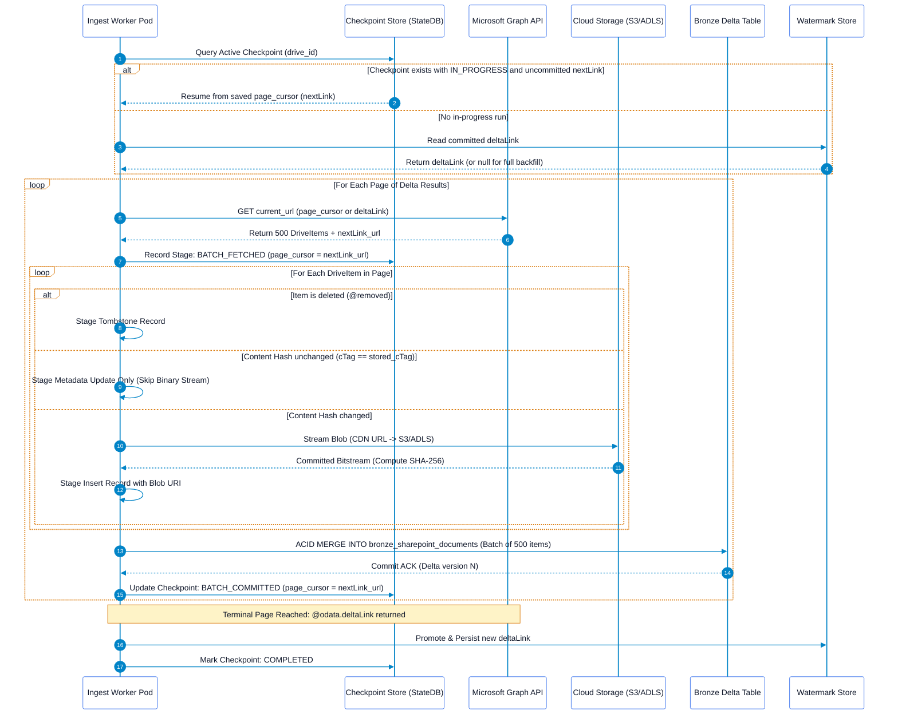
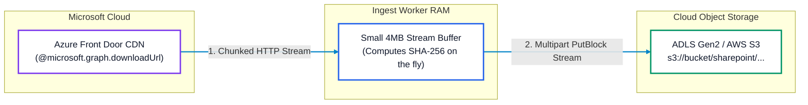
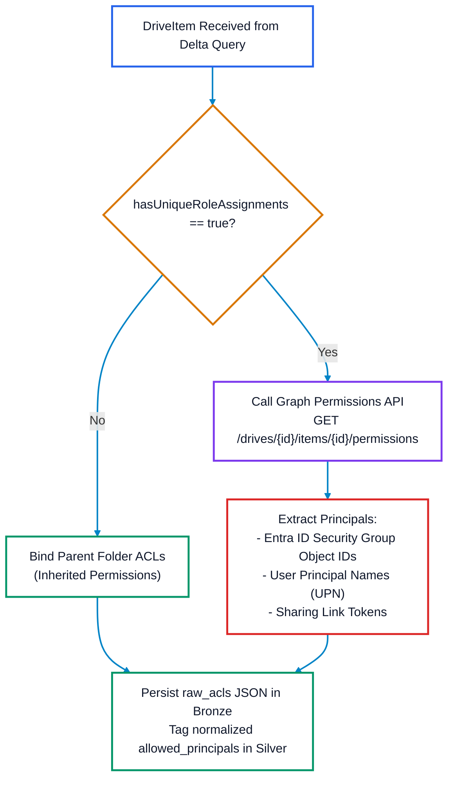

# SharePoint & OneDrive Pull Ingestor Solution Architecture

## Executive Summary
This document provides the production-ready solution architecture for the **SharePoint & OneDrive Pull Ingestor**. Operating under a pure pull-based paradigm, this ingestor connects to Microsoft 365 via the **Microsoft Graph Delta Query API**, incrementally synchronizing documents, spreadsheets, presentations, and list items into an Enterprise Data Lakehouse (Delta Lake / Apache Iceberg).

The ingestor guarantees **crash-resilient execution** (mid-process restart without rework), **strict Medallion layering**, **zero-trust query-time authorization**, and **enterprise-grade observability**.

---

## 1. End-to-End System Architecture



---

## 2. Microsoft Graph Delta Query Engine

### 2.1 Supported Query Scopes
The ingestor supports multiple discovery granularities:
* **Drive Level (Recommended)**: `GET /drives/{drive-id}/root/delta`  
  Captures all file creations, modifications, moves, renames, and deletions recursively across the entire document library.
* **Site List Level**: `GET /sites/{site-id}/lists/{list-id}/items/delta`  
  Synchronizes metadata-heavy lists and non-file document libraries.
* **User OneDrive Level**: `GET /users/{user-id}/drive/root/delta`  
  Ingests personal OneDrive document containers.

### 2.2 Delta Query Protocol & Pagination
Every synchronization cycle executes the following HTTP request cycle:

```http
GET https://graph.microsoft.com/v1.0/drives/{drive-id}/root/delta HTTP/1.1
Host: graph.microsoft.com
Authorization: Bearer <access_token>
Prefer: deltashowremoveddatashowalternatechangekey
Accept: application/json
```

1. **Intermediate Change Pages**:
   Responses contain up to `$top=500` items and include an `@odata.nextLink` URL:
   ```json
   {
     "@odata.context": "https://graph.microsoft.com/v1.0/$metadata#Collection(driveItem)",
     "@odata.nextLink": "https://graph.microsoft.com/v1.0/drives/{id}/root/delta?token=ey...",
     "value": [ ... ]
   }
   ```
2. **Terminal Completion Page**:
   When all active changes have been returned, Graph emits an `@odata.deltaLink` instead of `@odata.nextLink`:
   ```json
   {
     "@odata.context": "https://graph.microsoft.com/v1.0/$metadata#Collection(driveItem)",
     "@odata.deltaLink": "https://graph.microsoft.com/v1.0/drives/{id}/root/delta?token=delta_99z...",
     "value": []
   }
   ```
   * The opaque `@odata.deltaLink` token encodes the precise transaction log position within SharePoint.
   * On the subsequent sync run, querying this `@odata.deltaLink` retrieves **only** items modified since that moment.

### 2.3 Token Expiry Protocol (`HTTP 410 Gone`)
* SharePoint delta tokens expire after **30 days** of inactivity or if internal transaction logs roll over.
* When this occurs, Microsoft Graph responds with:
  ```http
  HTTP/1.1 410 Gone
  Content-Type: application/json

  {
    "error": {
      "code": "resyncRequired",
      "message": "Delta token is expired or invalid. Full synchronization required."
    }
  }
  ```
* **Recovery Protocol**:
  1. The worker intercepts `HTTP 410` with `resyncRequired`.
  2. The worker marks the checkpoint as `EXPIRED_RESET`.
  3. The worker clears the saved `deltaLink` from `ingestion_watermarks`.
  4. The worker restarts synchronization from `/drives/{id}/root/delta` (initial cold-start mode).
  5. Content hashing (SHA-256) ensures existing files in Cloud Storage and Silver tables are matched without re-downloading or re-embedding.

---

## 3. Mid-Process Restart & Reliability Engine (Zero Rework)

Enterprise SharePoint libraries frequently contain millions of documents. If an ingestor pod crashes 80% through a 4-hour synchronization run, re-running from page 1 wastes substantial compute, consumes tenant API quota, and incurs redundant egress costs.

The **Zero-Rework Engine** guarantees that an ingestor resumes from the exact page where it was interrupted.

### 3.1 State Machine & Checkpoint Lifecycle



### 3.2 Checkpoint State Store Schema
The checkpoint store is maintained in an ACID-compliant table (`ingestion_state_checkpoints`):

```sql
CREATE TABLE IF NOT EXISTS ingestion_state_checkpoints (
    tenant_id               STRING NOT NULL,
    container_id            STRING NOT NULL,     -- drive_id
    run_id                  STRING NOT NULL,     -- UUID per invocation
    stage                   STRING NOT NULL,     -- 'INITIALIZED', 'IN_PROGRESS', 'BATCH_COMMITTED', 'COMPLETED', 'FAILED'
    active_page_cursor      STRING,              -- @odata.nextLink URL
    pending_delta_link      STRING,              -- Terminal @odata.deltaLink
    items_processed_in_run  BIGINT NOT NULL DEFAULT 0,
    bytes_streamed_in_run   BIGINT NOT NULL DEFAULT 0,
    last_error_message      STRING,
    created_at              TIMESTAMP NOT NULL,
    updated_at              TIMESTAMP NOT NULL
) USING DELTA
PARTITIONED BY (tenant_id);
```

### 3.3 Crash Recovery Matrix

| Crash Point | System State | Resume Action on Container Restart | Rework Incurred |
| :--- | :--- | :--- | :--- |
| **During Blob Streaming** | Some blobs written to object storage; batch not merged into Bronze. | Worker re-queries the stored `active_page_cursor`. Before streaming each item, worker checks if target key exists in Object Storage with matching SHA-256. If exists, streaming is skipped. | **Zero**. Storage key idempotency prevents redundant network transfers. |
| **During Bronze Delta Table Merge** | Merge transaction aborts due to Delta ACID rollback. | Delta transaction guarantees atomicity. On restart, worker re-reads the same page and re-applies the merge cleanly. | **Zero**. No duplicate records created. |
| **After Bronze Merge, Before Checkpoint Update** | Bronze has records, but checkpoint still points to prior cursor. | Worker fetches page again; `MERGE INTO` detects matching `(item_id, version_id)` and performs an idempotent no-op update. | **Minimal** (1 Graph GET call; zero blob downloads). |
| **Between Batches (Graceful Shutdown / Preemption)** | Checkpoint has committed `active_page_cursor`. | Worker initializes with `active_page_cursor` and immediately fetches next page. | **Zero rework**. |

### 3.4 Graceful Shutdown Signal Handler (POSIX SIGTERM / SIGINT)
Ingestors deployed on Kubernetes or spot VMs must handle preemption signals cleanly:

```python
import signal
import sys
import logging

class GracefulKiller:
    kill_now = False
    def __init__(self):
        signal.signal(signal.SIGINT, self.exit_gracefully)
        signal.signal(signal.SIGTERM, self.exit_gracefully)

    def exit_gracefully(self, signum, frame):
        logging.warning(f"Received termination signal {signum}. Completing current item and halting pagination.")
        self.kill_now = True

# Ingest Loop Hook
killer = GracefulKiller()
while current_url and not killer.kill_now:
    # Process current page batch...
    commit_batch_and_checkpoint(next_cursor)
    if killer.kill_now:
        logging.info("Clean shutdown achieved. Cursor bookmarked. Exiting.")
        sys.exit(0)
```

---

## 4. Binary Downloads & Content-Addressable Storage

### 4.1 Direct Pre-Authenticated CDN Streaming
* DriveItems in Graph Delta responses provide an `@microsoft.graph.downloadUrl` attribute.
* This URL points to **Azure Front Door / Microsoft Edge CDN nodes**.
* **Zero Buffer Rule**: Workers never read entire files into RAM (`bytearray` or `BytesIO`). Streams are piped directly via chunked transfer (`requests.get(stream=True)`) into the cloud object store multi-part upload client (`boto3`, `azure-storage-blob`, or `google-cloud-storage`).



### 4.2 Deterministic Path Specification
Blob storage URIs follow a deterministic, content-addressed path:

```
abfss://lakehouse@{account}.dfs.core.windows.net/raw/sharepoint/{tenant_id}/{drive_id}/{item_id}/{content_sha256}.{extension}
```

* **Content-Addressable**: If an item is renamed, its storage path remains unchanged unless its contents change.
* **FinOps Optimization**: If an administrator modifies file metadata, tags, or permissions without changing file content, the worker verifies `cTag` or `content_sha256`, skips the download, and updates only the Lakehouse metadata row.

---

## 5. Security, Identity & Late-Binding Access Control (ACLs)

### 5.1 Permission Inheritance & Extraction
SharePoint permissions operate on an inheritance hierarchy (Site -> Library -> Folder -> Item).



### 5.2 Late-Binding Query Enforcement (Fail-Closed)
1. **No Static User Bakes**: Permissions are never statically attached to text chunks based on individual user IDs.
2. **Group Object IDs**: Silver chunks store arrays of authorized Entra ID Group IDs (`authorized_group_ids: ["9b1deb4d-3b7d-4b69-9d54-8e3d4615dd10", ...]`).
3. **Query-Time Filter**: When an enterprise user executes a RAG vector search, the query service retrieves their evaluated active Entra ID group memberships and injects a row-level filter:
   $$\text{Filter: } \text{user\_active\_groups} \cap \text{chunk\_authorized\_groups} \neq \emptyset$$
4. **Fail-Closed Rule**: If the permission endpoint fails with `HTTP 403` or timeout, the record is flagged with `is_restricted = TRUE` and omitted from the Gold consumption view.

---

## 6. Tombstone & Lifecycle Propagation

### 6.1 Delta Deletion Detection (`@removed`)
When a file or folder is deleted in SharePoint, the Delta response emits a tombstone facet:

```json
{
  "@odata.type": "#microsoft.graph.driveItem",
  "id": "01ABCD5678EFGH",
  "name": "Q3_Report.docx",
  "@removed": {
    "reason": "deleted"
  }
}
```

### 6.2 Cascade Purge Lifecycle
1. **Bronze Lakehouse**: The ingestor appends a tombstone audit record:
   ```sql
   INSERT INTO bronze_sharepoint_documents (
       tenant_id, container_id, item_id, is_deleted, deleted_at, ingestion_timestamp
   ) VALUES (
       'contoso_tenant', 'drive_123', '01ABCD5678EFGH', TRUE, CURRENT_TIMESTAMP(), CURRENT_TIMESTAMP()
   );
   ```
2. **Silver Table**: The silver transformation pipeline sets `is_active = FALSE` for all chunks associated with `01ABCD5678EFGH`.
3. **Vector Database**: Downstream vector synchronizer issues an immediate filter deletion to eliminate zombie citations:
   ```python
   vector_store.delete(filter={"item_id": "01ABCD5678EFGH"})
   ```

---

## 7. Network Resilience & Rate Limiting

### 7.1 Throttling Protection (HTTP 429 & Decorrelated Jitter)
Microsoft Graph enforces tenant-level request thresholds. The ingestor implements a strict backoff algorithm:

```python
import time
import random
import requests

def graph_request_with_backoff(url: str, headers: dict, max_retries: int = 5):
    attempt = 0
    sleep_time = 1.0
    
    while attempt < max_retries:
        response = requests.get(url, headers=headers)
        
        if response.status_code == 429:
            attempt += 1
            retry_after = response.headers.get("Retry-After")
            if retry_after:
                backoff = float(retry_after)
            else:
                # Full jitter exponential backoff
                backoff = min(60.0, sleep_time * (2 ** attempt)) + random.uniform(0.5, 1.5)
            
            logging.warning(f"Graph HTTP 429 Throttled. Backing off for {backoff:.2f}s (Attempt {attempt}/{max_retries})")
            time.sleep(backoff)
            continue
            
        return response
        
    response.raise_for_status()
```

---

## 8. Observability, Logging & Monitoring

### 8.1 Prometheus Metrics Catalog

| Metric Name | Type | Labels | Description |
| :--- | :--- | :--- | :--- |
| `sharepoint_sync_duration_seconds` | Histogram | `tenant_id`, `drive_id`, `status` | Total duration of a drive synchronization run. |
| `sharepoint_items_discovered_total` | Counter | `tenant_id`, `drive_id` | Count of DriveItems identified in delta responses. |
| `sharepoint_items_downloaded_total` | Counter | `tenant_id`, `drive_id`, `mime_type` | Count of raw file binaries successfully streamed. |
| `sharepoint_items_skipped_cache_total` | Counter | `tenant_id`, `drive_id` | Count of files skipped due to identical content SHA-256. |
| `sharepoint_items_tombstoned_total` | Counter | `tenant_id`, `drive_id` | Count of deleted items (@removed) processed. |
| `sharepoint_bytes_streamed_total` | Counter | `tenant_id`, `drive_id` | Total raw payload bytes transferred to object storage. |
| `sharepoint_api_requests_total` | Counter | `endpoint`, `status_code` | HTTP requests to Microsoft Graph API. |
| `sharepoint_api_throttles_429_total` | Counter | `endpoint`, `drive_id` | Total HTTP 429 throttle responses encountered. |
| `sharepoint_watermark_lag_seconds` | Gauge | `tenant_id`, `drive_id` | Difference between `now()` and timestamp of last successful sync. |
| `sharepoint_checkpoint_commits_total` | Counter | `tenant_id`, `drive_id`, `stage` | Count of successful checkpoint transitions committed. |

### 8.2 OpenTelemetry Distributed Tracing
Every synchronization run initializes an OpenTelemetry root trace:

```
[Trace: sharepoint_sync_drive]
  ├── [Span: state.get_checkpoint]
  ├── [Span: graph.fetch_delta_page] (attributes: page_index=1, items_returned=500)
  │     ├── [Span: blob.stream_to_s3] (attributes: item_id, bytes=1542010, sha256)
  │     ├── [Span: graph.fetch_permissions] (attributes: item_id)
  │     └── [Span: delta.merge_bronze] (attributes: records=500)
  ├── [Span: state.commit_checkpoint] (attributes: cursor_url)
  └── [Span: watermark.commit_delta_link] (attributes: final_delta_token)
```

### 8.3 Structured JSON Audit Logging
Every log entry adheres to a structured schema compatible with Grafana Loki, Datadog, and AWS CloudWatch:

```json
{
  "timestamp": "2026-09-16T08:30:15.124Z",
  "level": "INFO",
  "logger": "sharepoint_pull_ingestor",
  "trace_id": "4bf92f3577b34da6a3ce929d0e0e4736",
  "span_id": "00f067aa0ba902b7",
  "tenant_id": "contoso_corp",
  "drive_id": "b!abcd1234efgh5678",
  "run_id": "e7b08d48-6a31-419b-a316-ff2c49987c2b",
  "event_type": "BLOB_STREAM_SUCCESS",
  "item_id": "01ABCD5678EFGH",
  "file_name": "Annual_Report_2025.pdf",
  "size_bytes": 15482910,
  "content_sha256": "e3b0c44298fc1c149afbf4c8996fb92427ae41e4649b934ca495991b7852b855",
  "storage_uri": "abfss://lakehouse@storage.dfs.core.windows.net/raw/sharepoint/contoso_corp/b!abcd/01ABCD/e3b0c4.pdf",
  "duration_ms": 342
}
```

### 8.4 Prometheus Operational Alerts (PromQL)

```yaml
groups:
  - name: sharepoint_ingestion_alerts
    rules:
      - alert: SharePointWatermarkLagHigh
        expr: sharepoint_watermark_lag_seconds > 86400
        for: 1h
        labels:
          severity: critical
        annotations:
          summary: "SharePoint Drive {{ $labels.drive_id }} synchronization lag exceeds 24 hours."

      - alert: SharePointThrottlingSpike
        expr: rate(sharepoint_api_throttles_429_total[15m]) > 0.1
        for: 5m
        labels:
          severity: warning
        annotations:
          summary: "High HTTP 429 throttling rate on SharePoint tenant {{ $labels.tenant_id }}."

      - alert: SharePointCheckpointStalled
        expr: increase(sharepoint_checkpoint_commits_total[1h]) == 0 and sharepoint_watermark_lag_seconds > 7200
        for: 30m
        labels:
          severity: critical
        annotations:
          summary: "SharePoint ingestor run stalled for drive {{ $labels.drive_id }}. No checkpoints committed in 1 hour."
```

---

## 9. Lakehouse Table Contracts & DDL

### 9.1 Bronze Delta Table DDL
```sql
CREATE TABLE IF NOT EXISTS bronze_sharepoint_documents (
    tenant_id               STRING NOT NULL,
    container_id            STRING NOT NULL,       -- drive_id
    item_id                 STRING NOT NULL,       -- Graph item id
    version_id              STRING NOT NULL,       -- eTag / cTag
    file_name               STRING NOT NULL,
    file_extension          STRING,
    mime_type               STRING,
    size_bytes              BIGINT,
    raw_blob_uri            STRING,                -- Cloud Object Storage URI
    content_sha256          STRING,                -- 64-char hex hash
    raw_acls                STRING,                -- Untouched JSON ACL payload
    raw_graph_metadata      STRING,                -- Untouched Graph JSON response
    is_deleted              BOOLEAN NOT NULL DEFAULT FALSE,
    deleted_at              TIMESTAMP,
    source_created_at       TIMESTAMP,
    source_modified_at      TIMESTAMP,
    ingestion_timestamp     TIMESTAMP NOT NULL DEFAULT CURRENT_TIMESTAMP(),
    ingestion_run_id        STRING NOT NULL
) USING DELTA
PARTITIONED BY (tenant_id, container_id);
```

### 9.2 Watermark State Table DDL
```sql
CREATE TABLE IF NOT EXISTS ingestion_watermarks (
    source_system           STRING NOT NULL,       -- 'sharepoint'
    tenant_id               STRING NOT NULL,
    container_id            STRING NOT NULL,       -- drive_id
    delta_link              STRING NOT NULL,       -- @odata.deltaLink
    last_successful_sync_at TIMESTAMP NOT NULL,
    items_synced_total      BIGINT NOT NULL,
    updated_at              TIMESTAMP NOT NULL
) USING DELTA
PARTITIONED BY (source_system, tenant_id);
```
