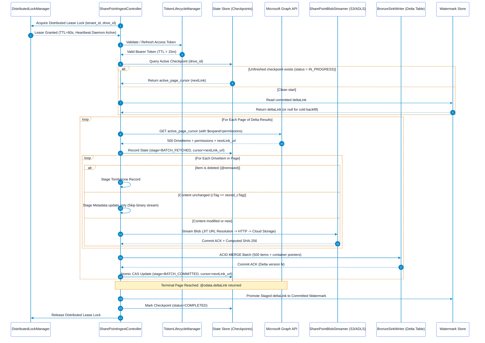

# SharePoint & OneDrive Pull Ingestor Solution Architecture

## Executive Summary
This document specifies the solution architecture for the **SharePoint & OneDrive Pull Ingestor**. Operating under a pure pull paradigm, this ingestor connects to Microsoft 365 via the **Microsoft Graph Delta Query API** to discover, stream, and catalog documents, spreadsheets, presentations, and list items into Cloud Object Storage and Lakehouse Bronze metadata tables.

This architecture focuses strictly on the **Ingestor Component**—its internal modular design, incremental state engine, mid-process crash recovery mechanisms, network resilience, container-level permission capture, and operational telemetry. Downstream parsing, chunking, and vector indexing are handled by external consumers decoupled from this ingestor.

---

## 1. Ingestor Component Architecture & Boundaries

The SharePoint Pull Ingestor runs as a stateless container pod or standalone daemon with well-defined internal modules and boundary interfaces:

```mermaid
flowchart TD
    subgraph UpstreamM365 ["1. Microsoft 365 Cloud (Upstream Source)"]
        EntraID["Microsoft Entra ID\n(OAuth2 Token Endpoint)"]:::purple
        GraphDelta["Microsoft Graph Delta Endpoint\nGET /drives/{id}/root/delta?$expand=permissions"]:::purple
        AzureCDN["Azure Front Door CDN\n(JIT @microsoft.graph.downloadUrl)"]:::purple
    end

    subgraph StateTier ["2. ACID State & Coordination Tier"]
        StateDB[("ingestion_state_checkpoints\n& ingestion_watermarks")]:::amber
        LockStore[("Distributed Mutex Store\n(Redis / DB Lease Heartbeats)")]:::amber
    end

    subgraph SharePointIngestor ["3. SharePoint Pull Ingestor Component"]
        LockMgr["DistributedLockManager\n(Lease Mutex & Run Fencing)"]:::blue
        Controller["SharePointIngestController\n(Run Lifecycle & SIGTERM Trapper)"]:::blue
        TokenMgr["TokenLifecycleManager\n(Proactive 75% TTL Renewal)"]:::cyan
        CheckpointMgr["SharePointCheckpointManager\n(Watermark & CAS Coordinator)"]:::amber
        RateLimiter["AdaptiveRateLimiter\n(Token Bucket & AIMD Throttle)"]:::blue
        DeltaClient["GraphDeltaClient\n(Delta Paging, Expansion & Backoff)"]:::blue
        TombstoneHandler["TombstoneDetector\n(@removed Deletion Handler)"]:::amber
        AclExtractor["SharePointAclExtractor\n(Container Hierarchy & Raw ACLs)"]:::red
        BlobStreamer["SharePointBlobStreamer\n(JIT URL, Zero-RAM Stream & Range Resume)"]:::cyan
        BronzeWriter["BronzeSinkWriter\n(Idempotent Delta Batch Committer)"]:::green
        Telemetry["IngestorTelemetry\n(Prometheus Metrics & OTel Traces)"]:::cyan
    end

    subgraph IngestSinks ["4. Storage & Lakehouse Sinks"]
        CloudStorage[("Cloud Object Storage (S3 / ADLS Gen2)\nDeterministic: .../{item_id}/{sha256}.{ext}")]:::green
        BronzeTable[("Bronze Document Delta Table\n(bronze_sharepoint_documents)")]:::green
        ContainerPermTable[("Bronze Container Perms Table\n(bronze_sharepoint_container_permissions)")]:::green
    end

    subgraph Observability ["5. Ingestor Observability Sinks"]
        Prom["Prometheus Collector\n(Scrapes /metrics)"]:::amber
        Otel["OpenTelemetry Collector\n(Trace Spans)"]:::cyan
        Logs["Log Aggregator\n(Structured JSON Logs)"]:::amber
    end

    %% Data Flow Transitions
    LockMgr <-->|1. Acquire / Heartbeat Lease| LockStore
    StateDB -->|2. Supply last cursor / deltaLink| CheckpointMgr
    CheckpointMgr -->|3. Feed start token| DeltaClient
    TokenMgr <-->|4. Proactively refresh JWT| EntraID
    TokenMgr -.->|Supply valid Bearer token| DeltaClient
    RateLimiter -.->|Enforce request tokens| DeltaClient
    DeltaClient <-->|5. Poll delta feed with $expand=permissions| GraphDelta

    DeltaClient -->|6a. @removed events| TombstoneHandler
    DeltaClient -->|6b. Items with permissions & hierarchy| AclExtractor
    DeltaClient -->|6c. File metadata & download triggers| BlobStreamer
    DeltaClient -->|6d. Unchanged items / metadata| BronzeWriter

    BlobStreamer <-->|7. JIT stream chunked bytes| AzureCDN
    BlobStreamer -->|8a. Multipart stream upload| CloudStorage
    BlobStreamer -->|8b. Supply Cloud URI + SHA-256| BronzeWriter
    AclExtractor -->|8c. Supply raw ACLs & container pointers| BronzeWriter
    AclExtractor -->|8d. Supply container ACL payloads| ContainerPermTable
    TombstoneHandler -->|8e. Supply tombstone records| BronzeWriter

    BronzeWriter -->|9. ACID Batch Merge| BronzeTable
    BronzeWriter -->|10. Batch committed ACK| CheckpointMgr
    CheckpointMgr -->|11. Atomic CAS cursor commit / promote deltaLink| StateDB

    %% Controller & Telemetry
    Controller -.->|Supervise run loop & trap SIGTERM| DeltaClient
    Controller -.->|Trigger batch flush| BronzeWriter
    Telemetry -.-> Prom
    Telemetry -.-> Otel
    Telemetry -.-> Logs

    %% Subgraphs Styling (Bigger container has thicker border line)
    style UpstreamM365 fill:none,stroke:#475569,stroke-width:2px,stroke-dasharray: 4 4,color:#475569
    style StateTier fill:none,stroke:#475569,stroke-width:2px,stroke-dasharray: 4 4,color:#475569
    style SharePointIngestor fill:none,stroke:#2563eb,stroke-width:3.5px,stroke-dasharray: 6 3,color:#2563eb
    style IngestSinks fill:none,stroke:#475569,stroke-width:2px,stroke-dasharray: 4 4,color:#475569
    style Observability fill:none,stroke:#475569,stroke-width:2px,stroke-dasharray: 4 4,color:#475569

    %% High-Visibility Link Arrows
    linkStyle default stroke:#0284c7,stroke-width:2px

    %% Dual-Mode Card Palette
    classDef default fill:#ffffff,stroke:#475569,stroke-width:2.5px,color:#0f172a;
    classDef blue    fill:#ffffff,stroke:#2563eb,stroke-width:2.5px,color:#0f172a;
    classDef green   fill:#ffffff,stroke:#059669,stroke-width:2.5px,color:#0f172a;
    classDef amber   fill:#ffffff,stroke:#d97706,stroke-width:2.5px,color:#0f172a;
    classDef purple  fill:#ffffff,stroke:#7c3aed,stroke-width:2.5px,color:#0f172a;
    classDef red     fill:#ffffff,stroke:#dc2626,stroke-width:2.5px,color:#0f172a;
    classDef cyan    fill:#ffffff,stroke:#0891b2,stroke-width:2.5px,color:#0f172a;
```



---

## 2. Ingestor Internal Subsystems

### 2.1 `DistributedLockManager` (Concurrency & Run Fencing)
Prevents overlapping runs from colliding on Delta Lake tables or corrupting checkpoint state:
* **Lease Acquisition**: Before executing, the worker acquires a distributed lease lock in Redis (`SET lock:sharepoint:{tenant_id}:{drive_id} {run_id} NX PX 60000`).
* **Heartbeat Renewal**: A daemon background thread refreshes the lease every 15 seconds while the sync cycle is active.
* **Fencing & Re-entrance Protection**: If the lease is held by another active run, the worker logs a collision warning, updates telemetry, and halts gracefully.

### 2.2 `TokenLifecycleManager` (Proactive Authentication)
Manages Microsoft Entra ID OAuth2 client credentials grant (`https://login.microsoftonline.com/{tenant_id}/oauth2/v2.0/token`):
* **Proactive 75% TTL Refresh**: Entra ID bearer tokens expire after 60–90 minutes. A background watchdog thread tracks expiration and requests a fresh token at **75% of token lifetime** (minute 45), eliminating in-flight `401 Unauthorized` interruptions.
* **Distributed Token Cache**: Caches active tokens in a shared Redis/Key Vault store with an atomic mutex to prevent multiple parallel pods from stampeding the Entra ID login endpoint.
* **Terminal Error Classification**: Categorizes `401 BadCredentials`, `401 InactiveToken`, and `403 InsufficientPrivileges` as terminal errors that trigger an immediate graceful stop and alert, preventing infinite retry loops.

### 2.3 `SharePointIngestController` (Lifecycle & Run Orchestration)
The central driver coordinating worker startup, recovery, batch processing, and shutdown:
* **Run Initialization**: Generates a unique `run_id` (UUID), acquires the distributed lease lock, initializes telemetry context, and queries `SharePointCheckpointManager` for an interrupted checkpoint.
* **Batch Loop**: Feeds page cursors to `GraphDeltaClient`, delegates item processing to `BlobStreamer` and `AclExtractor`, and triggers `BronzeSinkWriter`.
* **Signal Trapping**: Hooks POSIX `SIGTERM` and `SIGINT`. When the container is preempted or evicted, it finishes writing the active item, flushes the batch, commits the checkpoint, releases the lease, and halts gracefully.

### 2.4 `GraphDeltaClient` (Microsoft Graph Delta Protocol & Query Expansion)
Encapsulates all outbound HTTP communication with Microsoft Graph:
* **Delta Endpoints with Query Expansion**:
  - Drive-level: `GET /v1.0/drives/{drive-id}/root/delta?$expand=permissions&$top=500`
  - Site List-level: `GET /v1.0/sites/{site-id}/lists/{list-id}/items/delta?$expand=permissions&$top=500`
  - User OneDrive-level: `GET /v1.0/users/{user-id}/drive/root/delta?$expand=permissions&$top=500`
* **Eliminating the $O(N)$ Fan-Out**: By appending `$expand=permissions` directly to the delta query, the client retrieves unique role assignments in the same payload, completely eliminating the sequential `/items/{id}/permissions` subquery burst.
* **Request Configuration**:
  ```http
  GET /v1.0/drives/{drive-id}/root/delta?$expand=permissions&$top=500 HTTP/1.1
  Host: graph.microsoft.com
  Authorization: Bearer <access_token>
  Prefer: deltashowremoveddatashowalternatechangekey
  Accept: application/json
  ```
* **Pagination Handler**:
  - Traverses `@odata.nextLink` URLs across intermediate change pages.
  - Detects the final page by identifying the terminal `@odata.deltaLink`.

### 2.5 `SharePointCheckpointManager` (Mid-Process Restart & CAS Engine)
Ensures zero rework by persisting fine-grained state to the ACID state store:
* **Active Run Checkpointing**: Tracks `run_id`, `drive_id`, `active_page_cursor` (`@odata.nextLink`), `batch_sequence_number`, and `stage`.
* **Optimistic Compare-And-Swap (CAS)**: Checkpoint updates enforce:
  ```sql
  UPDATE ingestion_state_checkpoints
  SET active_page_cursor = :nextLink, stage = 'BATCH_COMMITTED', updated_at = CURRENT_TIMESTAMP()
  WHERE run_id = :run_id AND container_id = :drive_id AND stage = 'IN_PROGRESS';
  ```
  If zero rows are updated, the worker immediately aborts cleanly.
* **Two-Phase Delta Token Commit**: The terminal `@odata.deltaLink` is held in staging memory until all change pages in the cycle are written to Bronze. It is promoted only upon cycle completion.

### 2.6 `SharePointBlobStreamer` (JIT Resolution, Zero-Buffer & Range Resume)
Streams file binaries without consuming container memory:
* **Just-In-Time (JIT) URL Resolution**: Pre-signed `@microsoft.graph.downloadUrl` links expire after 15 minutes. To avoid expiration during large multi-file batches, the streamer resolves the download URL on demand (`GET /items/{id}?$select=id,@microsoft.graph.downloadUrl`) immediately prior to opening the streaming byte socket.
* **Piped Transfer**: Reads HTTP chunk streams (4MB chunks) directly into the cloud storage multi-part upload client (`boto3` / `azure-storage-blob`).
* **HTTP Range-Request Resume**: If a network connection drops during a multi-gigabyte transfer, the streamer resumes from the last committed chunk using `Range: bytes={offset}-` rather than re-downloading from byte 0.
* **Streaming Checksum**: Computes `SHA-256` incrementally on the fly as chunks transit through memory.
* **Deterministic Object URI**:
  `abfss://lakehouse@{account}.dfs.core.windows.net/raw/sharepoint/{tenant_id}/{drive_id}/{item_id}/{content_sha256}.{ext}`

### 2.7 `SharePointAclExtractor` (Container Inheritance Pointer Model)
Preserves native Access Control Lists and resolves inherited permission drift:
* **Container-Level Pointer Architecture**:
  - For items where `hasUniqueRoleAssignments == false`, the extractor sets `inherited_from_id = parent_folder_id` and does not replicate parent ACLs onto child records.
  - For items where `hasUniqueRoleAssignments == true`, the extractor records the raw unique role assignments into `raw_acls`.
* **Companion Container Permissions Table**: Container-level permissions (drive root and folders) are mirrored to `bronze_sharepoint_container_permissions`.
* **Late-Binding Query Security**: Downstream Silver/Gold query engines evaluate access permissions dynamically by joining child documents against their container permissions. Parent folder permission changes reflect immediately without requiring full library re-crawls.

### 2.8 `TombstoneDetector` (Deletion Detection)
* Detects the presence of `@removed: {"reason": "deleted"}` in the Graph response.
* Marks records with `is_deleted = TRUE`, capturing the deletion timestamp and reason for auditability.

### 2.9 `BronzeSinkWriter` (Idempotent Metadata Sinking)
* Merges metadata batches into the `bronze_sharepoint_documents` Delta table.
* Uses primary key `(tenant_id, container_id, item_id, version_id)` to ensure repeated execution of an interrupted batch produces zero duplicates.

---

## 3. Mid-Process Restart & Reliability Engine (Zero Rework)

Enterprise SharePoint libraries often contain hundreds of thousands of files. When an ingestor container is terminated mid-cycle, the engine guarantees resumption from the exact last uncommitted page.



### 3.1 Crash Recovery Matrix

| Crash Scenario | System State at Crash | Ingestor Action on Restart | Rework Incurred |
| :--- | :--- | :--- | :--- |
| **Crash during Blob Streaming** | Partial blobs written to Object Storage; batch not committed to Bronze. | Ingestor re-queries the saved `active_page_cursor`. For each item, it checks if the deterministic key (`.../{sha256}.{ext}`) already exists in Cloud Storage via `HEAD`. If present, streaming is bypassed. | **Zero duplicate bytes transferred.** |
| **Crash during Bronze Merge** | Bronze transaction rolled back automatically by Delta Lake ACID engine. | Ingestor re-fetches the same cursor; batch is re-merged cleanly. | **Zero duplicate records created.** |
| **Crash after Bronze Commit, before Checkpoint Commit** | Bronze table has records; checkpoint still points to previous cursor. | Ingestor re-reads the page; `MERGE INTO` detects existing `(item_id, version_id)` keys and performs an idempotent no-op. | Minimal (1 Graph GET call; zero re-downloads). |
| **Pre-Signed URL Expiration Mid-Batch** | Pre-signed URL (>15m old) returns 401/403 during sequential streaming. | `SharePointBlobStreamer` uses JIT URL acquisition to fetch a fresh download URL immediately before streaming. | **Zero batch failure.** |
| **Overlapping Run Spawned by Scheduler** | Slower sync run collides with scheduled CronJob. | Second worker fails to acquire distributed lease lock and exits cleanly without modifying state. | **Zero split-brain / zero lock conflict.** |
| **Graceful Preemption (SIGTERM)** | Kubernetes sends termination signal to worker pod. | `SharePointIngestController` traps signal, completes current batch, writes checkpoint, releases lease, and halts. | **Zero rework.** |

### 3.2 Token Expiry Recovery Protocol (`HTTP 410 Gone`)
Delta tokens expire after 30 days of inactivity or if SharePoint transaction logs roll over.
1. When Graph returns `HTTP 410 Gone` with code `resyncRequired`:
2. `GraphDeltaClient` catches the error.
3. `SharePointCheckpointManager` invalidates the stale `deltaLink` and marks the checkpoint as `RESET_REQUIRED`.
4. The ingestor initiates a fresh crawl from `/drives/{drive-id}/root/delta?$expand=permissions`.
5. Pre-flight checksum matching (`content_sha256`) against the Lakehouse Bronze catalog ensures existing files are matched without re-downloading binaries.

---

## 4. Network Resilience & Adaptive Rate-Limiting Engine

Microsoft Graph applies dynamic tenant-level and app-level throttling under burst operations.

### 4.1 Distributed Token Bucket & Adaptive Concurrency Control (AIMD)
The ingestor combines a cluster-wide token bucket with Additive Increase / Multiplicative Decrease (AIMD) concurrency control:

```python
import time
import random
import logging
import requests

class ResilientGraphClient:
    def __init__(self, tenant_id: str, max_concurrency: int = 16, min_concurrency: int = 2):
        self.tenant_id = tenant_id
        self.current_concurrency = max_concurrency
        self.min_concurrency = min_concurrency
        self.max_concurrency = max_concurrency
        self.last_success_time = time.time()

    def execute_request(self, url: str, headers: dict, max_retries: int = 5) -> requests.Response:
        attempt = 0
        base_sleep = 2.0

        while attempt < max_retries:
            resp = requests.get(url, headers=headers, timeout=30)

            # Detect Throttling and Gateway Degradation
            if resp.status_code in (429, 503, 504):
                attempt += 1
                # Multiplicative Decrease: Slash concurrency by 50%
                self.current_concurrency = max(self.min_concurrency, self.current_concurrency // 2)

                retry_after = resp.headers.get("Retry-After")
                if retry_after:
                    backoff = float(retry_after)
                else:
                    backoff = min(90.0, base_sleep * (2 ** attempt))

                # Full Decorrelated Jitter
                jittered_backoff = backoff + random.uniform(0.5, 2.0)
                logging.warning(
                    f"Graph throttled ({resp.status_code}). Slashed concurrency to {self.current_concurrency}. "
                    f"Backing off {jittered_backoff:.2f}s (Attempt {attempt}/{max_retries})"
                )
                time.sleep(jittered_backoff)
                continue

            # Terminal Authentication Errors
            if resp.status_code in (401, 403):
                logging.error(f"Unrecoverable auth failure ({resp.status_code}): {resp.text}")
                resp.raise_for_status()

            resp.raise_for_status()

            # Additive Increase: Increment concurrency every 60s of stable execution
            if time.time() - self.last_success_time > 60.0:
                self.current_concurrency = min(self.max_concurrency, self.current_concurrency + 1)
                self.last_success_time = time.time()

            return resp

        raise RuntimeError(f"Exceeded max retries ({max_retries}) for Graph API: {url}")
```

---

## 5. Ingestor Observability & Telemetry

### 5.1 Prometheus Metrics Catalog

| Metric Name | Type | Labels | Description |
| :--- | :--- | :--- | :--- |
| `sharepoint_sync_duration_seconds` | Histogram | `tenant_id`, `drive_id`, `status` | Execution duration of a drive synchronization run. |
| `sharepoint_items_discovered_total` | Counter | `tenant_id`, `drive_id` | Count of DriveItems returned in delta responses. |
| `sharepoint_items_downloaded_total` | Counter | `tenant_id`, `drive_id`, `mime_type` | Count of raw file binaries successfully streamed. |
| `sharepoint_items_skipped_cache_total` | Counter | `tenant_id`, `drive_id` | Count of files skipped due to identical content SHA-256. |
| `sharepoint_items_tombstoned_total` | Counter | `tenant_id`, `drive_id` | Count of deleted items (@removed) processed. |
| `sharepoint_bytes_streamed_total` | Counter | `tenant_id`, `drive_id` | Total raw payload bytes transferred to cloud storage. |
| `sharepoint_api_requests_total` | Counter | `endpoint`, `status_code` | Total HTTP requests made to Microsoft Graph API. |
| `sharepoint_api_throttles_429_total` | Counter | `endpoint`, `drive_id` | Count of HTTP 429 throttle responses encountered. |
| `sharepoint_concurrency_threads` | Gauge | `tenant_id`, `drive_id` | Active worker concurrency governed by AIMD throttler. |
| `sharepoint_lock_acquisitions_total` | Counter | `tenant_id`, `drive_id`, `status` | Count of distributed lease lock acquisition attempts. |
| `sharepoint_watermark_lag_seconds` | Gauge | `tenant_id`, `drive_id` | Time delta between `now()` and timestamp of last successful sync. |
| `sharepoint_checkpoint_commits_total` | Counter | `tenant_id`, `drive_id`, `stage` | Count of checkpoint state transitions committed. |

### 5.2 OpenTelemetry Distributed Tracing
```
[Trace: sharepoint_sync_drive]
  ├── [Span: lock.acquire_lease] (attributes: lease_ttl=60s)
  ├── [Span: token.verify_jwt] (attributes: expires_in=2700s)
  ├── [Span: checkpoint.get_active_cursor]
  ├── [Span: graph.fetch_delta_page] (attributes: page_size=500, expand="permissions")
  │     ├── [Span: blob.jit_resolve_url] (attributes: item_id="01ABCD")
  │     ├── [Span: blob.stream_to_storage] (attributes: item_id="01ABCD", bytes=1542010, sha256)
  │     ├── [Span: acl.extract_hierarchy] (attributes: item_id="01ABCD", parent_id="01PARENT")
  │     └── [Span: bronze.acid_merge_batch] (attributes: batch_size=500)
  ├── [Span: checkpoint.cas_commit_batch] (attributes: committed_cursor)
  ├── [Span: watermark.commit_delta_link] (attributes: delta_token)
  └── [Span: lock.release_lease]
```

### 5.3 Structured JSON Audit Logging
```json
{
  "timestamp": "2026-09-16T08:30:15.124Z",
  "level": "INFO",
  "logger": "sharepoint_pull_ingestor",
  "trace_id": "4bf92f3577b34da6a3ce929d0e0e4736",
  "span_id": "00f067aa0ba902b7",
  "tenant_id": "contoso_corp",
  "drive_id": "b!abcd1234efgh5678",
  "run_id": "e7b08d48-6a31-419b-a316-ff2c49987c2b",
  "event_type": "BLOB_STREAM_SUCCESS",
  "item_id": "01ABCD5678EFGH",
  "parent_item_id": "01PARENT1234",
  "has_unique_role_assignments": false,
  "file_name": "Annual_Report_2025.pdf",
  "size_bytes": 15482910,
  "content_sha256": "e3b0c44298fc1c149afbf4c8996fb92427ae41e4649b934ca495991b7852b855",
  "storage_uri": "abfss://lakehouse@storage.dfs.core.windows.net/raw/sharepoint/contoso_corp/b!abcd/01ABCD/e3b0c4.pdf",
  "duration_ms": 342
}
```

---

## 6. External Data Contracts & Table DDL

### 6.1 Bronze Document Metadata Table DDL (`bronze_sharepoint_documents`)
```sql
CREATE TABLE IF NOT EXISTS bronze_sharepoint_documents (
    tenant_id                   STRING NOT NULL,
    container_id                STRING NOT NULL,       -- drive_id
    item_id                     STRING NOT NULL,       -- Graph item id
    version_id                  STRING NOT NULL,       -- eTag / cTag
    parent_item_id              STRING,                -- Parent folder id
    inherited_from_id           STRING,                -- ID of container governing permissions
    has_unique_role_assignments BOOLEAN NOT NULL DEFAULT FALSE,
    file_name                   STRING NOT NULL,
    file_extension              STRING,
    mime_type                   STRING,
    size_bytes                  BIGINT,
    raw_blob_uri                STRING,                -- Cloud Object Storage URI
    content_sha256              STRING,                -- 64-char hex hash
    raw_acls                    STRING,                -- Untouched JSON ACL payload (if unique)
    raw_graph_metadata          STRING,                -- Untouched Graph JSON response
    is_deleted                  BOOLEAN NOT NULL DEFAULT FALSE,
    deleted_at                  TIMESTAMP,
    source_created_at           TIMESTAMP,
    source_modified_at          TIMESTAMP,
    ingestion_timestamp         TIMESTAMP NOT NULL DEFAULT CURRENT_TIMESTAMP(),
    ingestion_run_id            STRING NOT NULL
) USING DELTA
PARTITIONED BY (tenant_id, container_id);
```

### 6.2 Bronze Container Permissions Table DDL (`bronze_sharepoint_container_permissions`)
```sql
CREATE TABLE IF NOT EXISTS bronze_sharepoint_container_permissions (
    tenant_id               STRING NOT NULL,
    container_id            STRING NOT NULL,           -- drive_id or folder item_id
    container_type          STRING NOT NULL,           -- 'DRIVE_ROOT', 'FOLDER'
    raw_acls                STRING NOT NULL,           -- Untouched JSON permissions payload
    sync_timestamp          TIMESTAMP NOT NULL DEFAULT CURRENT_TIMESTAMP(),
    ingestion_run_id        STRING NOT NULL
) USING DELTA
PARTITIONED BY (tenant_id, container_id);
```

### 6.3 Checkpoint State Store DDL (`ingestion_state_checkpoints`)
```sql
CREATE TABLE IF NOT EXISTS ingestion_state_checkpoints (
    tenant_id               STRING NOT NULL,
    container_id            STRING NOT NULL,       -- drive_id
    run_id                  STRING NOT NULL,       -- UUID per run
    stage                   STRING NOT NULL,       -- 'IN_PROGRESS', 'BATCH_COMMITTED', 'COMPLETED', 'FAILED'
    active_page_cursor      STRING,                -- @odata.nextLink URL
    pending_delta_link      STRING,                -- Terminal @odata.deltaLink
    items_processed_in_run  BIGINT NOT NULL DEFAULT 0,
    bytes_streamed_in_run   BIGINT NOT NULL DEFAULT 0,
    last_error_message      STRING,
    created_at              TIMESTAMP NOT NULL,
    updated_at              TIMESTAMP NOT NULL
) USING DELTA
PARTITIONED BY (tenant_id);
```
