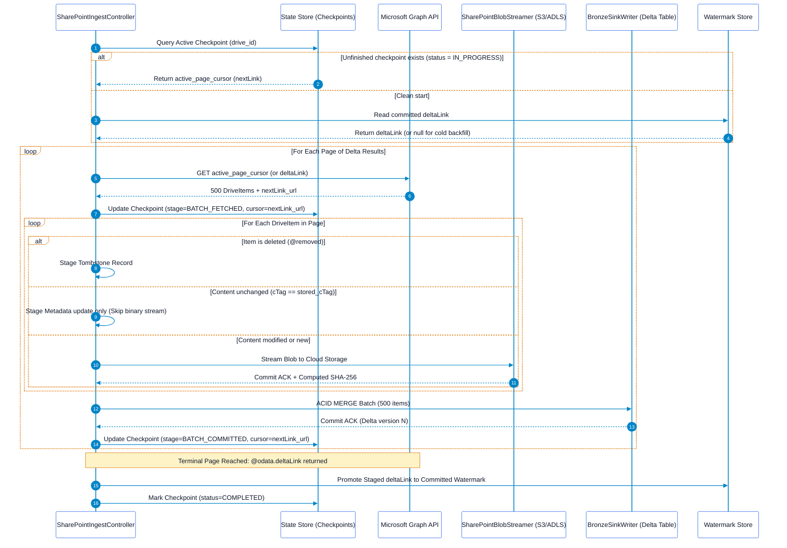

# SharePoint & OneDrive Pull Ingestor Solution Architecture

## Executive Summary
This document specifies the solution architecture for the **SharePoint & OneDrive Pull Ingestor**. Operating under a pure pull paradigm, this ingestor connects to Microsoft 365 via the **Microsoft Graph Delta Query API** to discover, stream, and catalog documents, spreadsheets, presentations, and list items into Cloud Object Storage and Lakehouse Bronze metadata tables.

This architecture focuses strictly on the **Ingestor Component**—its internal modular design, incremental state engine, mid-process crash recovery mechanisms, network resilience, raw permission capture, and operational telemetry. Downstream parsing, chunking, and vector indexing are handled by external consumers decoupled from this ingestor.

---

## 1. Ingestor Component Architecture & Boundaries

The SharePoint Pull Ingestor runs as a stateless container pod or standalone daemon with well-defined internal modules and boundary interfaces:

```mermaid
flowchart TD
    subgraph UpstreamM365 ["1. Microsoft 365 Cloud (Upstream Source)"]
        GraphDelta["Microsoft Graph Delta Endpoint\nGET /drives/{id}/root/delta"]:::purple
        GraphPerms["Permissions Endpoint\nGET /items/{id}/permissions"]:::purple
        AzureCDN["Azure Front Door CDN\n(@microsoft.graph.downloadUrl)"]:::purple
    end

    subgraph StateTier ["2. ACID State Store"]
        StateDB[("ingestion_state_checkpoints\n& ingestion_watermarks")]:::amber
    end

    subgraph SharePointIngestor ["3. SharePoint Pull Ingestor Component"]
        Controller["SharePointIngestController\n(Run Lifecycle & SIGTERM Trapper)"]:::blue
        CheckpointMgr["SharePointCheckpointManager\n(Watermark & Cursor Coordinator)"]:::amber
        DeltaClient["GraphDeltaClient\n(Delta Paging & 429 Backoff)"]:::blue
        TombstoneHandler["TombstoneDetector\n(@removed Deletion Handler)"]:::amber
        AclExtractor["SharePointAclExtractor\n(hasUniqueRoleAssignments & Raw ACLs)"]:::red
        BlobStreamer["SharePointBlobStreamer\n(Zero-RAM HTTP -> S3/ADLS & SHA-256)"]:::cyan
        BronzeWriter["BronzeSinkWriter\n(Idempotent Delta Batch Committer)"]:::green
        Telemetry["IngestorTelemetry\n(Prometheus Metrics & OTel Traces)"]:::cyan
    end

    subgraph IngestSinks ["4. Storage & Lakehouse Sinks"]
        CloudStorage[("Cloud Object Storage (S3 / ADLS Gen2)\nDeterministic: .../{item_id}/{sha256}.{ext}")]:::green
        BronzeTable[("Bronze Metadata Delta Table\n(bronze_sharepoint_documents)")]:::green
    end

    subgraph Observability ["5. Ingestor Observability Sinks"]
        Prom["Prometheus Collector\n(Scrapes /metrics)"]:::amber
        Otel["OpenTelemetry Collector\n(Trace Spans)"]:::cyan
        Logs["Log Aggregator\n(Structured JSON Logs)"]:::amber
    end

    %% Data Flow Transitions
    StateDB -->|1. Supply last cursor / deltaLink| CheckpointMgr
    CheckpointMgr -->|2. Feed start token| DeltaClient
    DeltaClient <-->|3. Poll delta change feed| GraphDelta

    DeltaClient -->|4a. @removed events| TombstoneHandler
    DeltaClient -->|4b. Items with unique perms| AclExtractor
    DeltaClient -->|4c. File metadata & downloadUrl| BlobStreamer
    DeltaClient -->|4d. Unchanged items / metadata| BronzeWriter

    AclExtractor <-->|Fetch raw permissions| GraphPerms
    BlobStreamer <-->|Stream chunked bytes| AzureCDN

    BlobStreamer -->|5a. Multipart stream upload| CloudStorage
    BlobStreamer -->|5b. Supply Cloud URI + SHA-256| BronzeWriter
    AclExtractor -->|5c. Supply raw ACL payloads| BronzeWriter
    TombstoneHandler -->|5d. Supply tombstone records| BronzeWriter

    BronzeWriter -->|6. ACID Batch Merge| BronzeTable
    BronzeWriter -->|7. Batch committed ACK| CheckpointMgr
    CheckpointMgr -->|8. Commit cursor / promote deltaLink| StateDB

    %% Controller & Telemetry
    Controller -.->|Supervise run loop & trap SIGTERM| DeltaClient
    Controller -.->|Trigger batch flush| BronzeWriter
    Telemetry -.-> Prom
    Telemetry -.-> Otel
    Telemetry -.-> Logs

    %% Subgraphs Styling
    style UpstreamM365 fill:none,stroke:#475569,stroke-width:2px,stroke-dasharray: 4 4,color:#475569
    style StateTier fill:none,stroke:#475569,stroke-width:2px,stroke-dasharray: 4 4,color:#475569
    style SharePointIngestor fill:none,stroke:#475569,stroke-width:2px,stroke-dasharray: 4 4,color:#475569
    style IngestSinks fill:none,stroke:#475569,stroke-width:2px,stroke-dasharray: 4 4,color:#475569
    style Observability fill:none,stroke:#475569,stroke-width:2px,stroke-dasharray: 4 4,color:#475569

    %% High-Visibility Link Arrows
    linkStyle default stroke:#0284c7,stroke-width:2px

    %% Dual-Mode Card Palette
    classDef default fill:#ffffff,stroke:#475569,stroke-width:2.5px,color:#0f172a;
    classDef blue    fill:#ffffff,stroke:#2563eb,stroke-width:2.5px,color:#0f172a;
    classDef green   fill:#ffffff,stroke:#059669,stroke-width:2.5px,color:#0f172a;
    classDef amber   fill:#ffffff,stroke:#d97706,stroke-width:2.5px,color:#0f172a;
    classDef purple  fill:#ffffff,stroke:#7c3aed,stroke-width:2.5px,color:#0f172a;
    classDef red     fill:#ffffff,stroke:#dc2626,stroke-width:2.5px,color:#0f172a;
    classDef cyan    fill:#ffffff,stroke:#0891b2,stroke-width:2.5px,color:#0f172a;
```



---

## 2. Ingestor Internal Subsystems

### 2.1 `SharePointIngestController` (Lifecycle & Run Orchestration)
The central driver that coordinates worker startup, recovery, batch processing, and shutdown:
* **Run Initialization**: Generates a unique `run_id` (UUID), initializes telemetry context, and queries the `SharePointCheckpointManager` for an interrupted checkpoint.
* **Batch Loop**: Feeds page cursors to the `GraphDeltaClient`, delegates item processing to `BlobStreamer` and `AclExtractor`, and triggers `BronzeSinkWriter`.
* **Signal Trapping**: Hooks POSIX `SIGTERM` and `SIGINT`. When the container is preempted or evicted, it finishes writing the active item, flushes the batch, commits the checkpoint, and halts gracefully.

### 2.2 `GraphDeltaClient` (Microsoft Graph Delta Protocol)
Encapsulates all outbound HTTP communication with Microsoft Graph:
* **Authentication**: Manages OAuth2 client credentials grant via Microsoft Entra ID (`https://login.microsoftonline.com/{tenant_id}/oauth2/v2.0/token`) with automated token refresh before expiry.
* **Delta Endpoints**:
  - Drive-level (Document Library): `GET /drives/{drive-id}/root/delta`
  - Site List-level: `GET /sites/{site-id}/lists/{list-id}/items/delta`
  - User OneDrive-level: `GET /users/{user-id}/drive/root/delta`
* **Request Configuration**:
  ```http
  GET /v1.0/drives/{drive-id}/root/delta?$top=500 HTTP/1.1
  Host: graph.microsoft.com
  Authorization: Bearer <access_token>
  Prefer: deltashowremoveddatashowalternatechangekey
  Accept: application/json
  ```
* **Pagination Handler**:
  - Traverses `@odata.nextLink` URLs across intermediate change pages.
  - Detects the final page by identifying the terminal `@odata.deltaLink`.

### 2.3 `SharePointCheckpointManager` (Mid-Process Restart Engine)
Ensures zero rework by persisting fine-grained state to the ACID state store:
* **Active Run Checkpointing**: Tracks `run_id`, `drive_id`, `active_page_cursor` (`@odata.nextLink`), `batch_sequence_number`, and `stage`.
* **Two-Phase Delta Token Commit**: The terminal `@odata.deltaLink` is held in staging memory until all change pages in the cycle are written to Bronze. It is promoted only upon cycle completion.

### 2.4 `SharePointBlobStreamer` (Direct Zero-Buffer Streaming)
Streams file binaries without consuming container memory:
* **CDN Endpoint**: Resolves `@microsoft.graph.downloadUrl`, pointing to Azure Front Door edge nodes.
* **Piped Transfer**: Reads HTTP chunk streams (e.g. 4MB chunks) directly into the cloud storage multi-part upload client (`boto3` / `azure-storage-blob`).
* **Streaming Checksum**: Computes `SHA-256` incrementally on the fly as chunks transit through memory.
* **Deterministic Object URI**:
  `abfss://lakehouse@{account}.dfs.core.windows.net/raw/sharepoint/{tenant_id}/{drive_id}/{item_id}/{content_sha256}.{ext}`

### 2.5 `SharePointAclExtractor` (Source Permission Ingestion)
Preserves native Access Control Lists untouched:
* **Inheritance Inspection**: Inspects `hasUniqueRoleAssignments`. If `false`, the item inherits parent container permissions.
* **Permission Query**: If `hasUniqueRoleAssignments == true`, calls:
  `GET /v1.0/drives/{drive-id}/items/{item-id}/permissions`
* **Raw Preservation**: Normalizes the JSON response into the raw ACL payload written to Bronze without flattening or stripping Entra ID Group IDs.

### 2.6 `TombstoneDetector` (Deletion Detection)
* Detects the presence of `@removed: {"reason": "deleted"}` in the Graph response.
* Marks records with `is_deleted = TRUE`, capturing the deletion timestamp and reason for auditability.

### 2.7 `BronzeSinkWriter` (Idempotent Metadata Sinking)
* Merges metadata batches into the `bronze_sharepoint_documents` Delta table.
* Uses primary key `(tenant_id, container_id, item_id, version_id)` to ensure repeated execution of an interrupted batch produces zero duplicates.

---

## 3. Mid-Process Restart & Reliability Engine (Zero Rework)

Enterprise SharePoint libraries often contain hundreds of thousands of files. When an ingestor container is terminated mid-cycle, the engine guarantees resumption from the exact last uncommitted page.



### 3.1 Crash Recovery Matrix

| Crash Scenario | System State at Crash | Ingestor Action on Restart | Rework Incurred |
| :--- | :--- | :--- | :--- |
| **Crash during Blob Streaming** | Partial blobs written to Object Storage; batch not committed to Bronze. | Ingestor re-queries the saved `active_page_cursor`. For each item, it checks if the deterministic key (`.../{sha256}.{ext}`) already exists in Cloud Storage via `HEAD`. If present, streaming is bypassed. | **Zero duplicate bytes transferred.** |
| **Crash during Bronze Merge** | Bronze transaction rolled back automatically by Delta Lake ACID engine. | Ingestor re-fetches the same cursor; batch is re-merged cleanly. | **Zero duplicate records created.** |
| **Crash after Bronze Commit, before Checkpoint Commit** | Bronze table has records; checkpoint still points to previous cursor. | Ingestor re-reads the page; `MERGE INTO` detects existing `(item_id, version_id)` keys and performs an idempotent no-op. | Minimal (1 Graph GET call; zero re-downloads). |
| **Graceful Preemption (SIGTERM)** | Kubernetes sends termination signal to worker pod. | `SharePointIngestController` traps signal, completes current batch, writes checkpoint, and halts. | **Zero rework.** |

### 3.2 Token Expiry Recovery Protocol (`HTTP 410 Gone`)
Delta tokens expire after 30 days of inactivity or if SharePoint transaction logs roll over.
1. When Graph returns `HTTP 410 Gone` with code `resyncRequired`:
2. `GraphDeltaClient` catches the error.
3. `SharePointCheckpointManager` invalidates the stale `deltaLink` and marks the checkpoint as `RESET_REQUIRED`.
4. The ingestor initiates a fresh crawl from `/drives/{drive-id}/root/delta`.
5. Pre-flight checksum matching (`content_sha256`) against the Lakehouse Bronze catalog ensures existing files are matched without re-downloading binaries.

---

## 4. Network Resilience & Rate-Limiting Engine

Microsoft Graph applies dynamic tenant-level throttling under burst operations.

### 4.1 Throttling Protection (HTTP 429 & Decorrelated Jitter)
The ingestor implements the full jitter exponential backoff protocol:

```python
import time
import random
import requests
import logging

class ResilientGraphClient:
    def execute_request(self, url: str, headers: dict, max_retries: int = 5) -> requests.Response:
        attempt = 0
        base_sleep = 1.0

        while attempt < max_retries:
            resp = requests.get(url, headers=headers, timeout=30)

            if resp.status_code == 429:
                attempt += 1
                retry_after = resp.headers.get("Retry-After")
                if retry_after:
                    backoff = float(retry_after)
                else:
                    backoff = min(60.0, base_sleep * (2 ** attempt)) + random.uniform(0.5, 1.5)

                logging.warning(
                    f"Graph throttled (HTTP 429). Backing off {backoff:.2f}s "
                    f"(Attempt {attempt}/{max_retries})"
                )
                time.sleep(backoff)
                continue

            resp.raise_for_status()
            return resp

        raise RuntimeError(f"Exceeded max retries ({max_retries}) for URL: {url}")
```

---

## 5. Ingestor Observability & Telemetry

### 5.1 Prometheus Metrics Catalog

| Metric Name | Type | Labels | Description |
| :--- | :--- | :--- | :--- |
| `sharepoint_sync_duration_seconds` | Histogram | `tenant_id`, `drive_id`, `status` | Execution duration of a drive synchronization run. |
| `sharepoint_items_discovered_total` | Counter | `tenant_id`, `drive_id` | Count of DriveItems returned in delta responses. |
| `sharepoint_items_downloaded_total` | Counter | `tenant_id`, `drive_id`, `mime_type` | Count of raw file binaries successfully streamed. |
| `sharepoint_items_skipped_cache_total` | Counter | `tenant_id`, `drive_id` | Count of files skipped due to identical content SHA-256. |
| `sharepoint_items_tombstoned_total` | Counter | `tenant_id`, `drive_id` | Count of deleted items (@removed) processed. |
| `sharepoint_bytes_streamed_total` | Counter | `tenant_id`, `drive_id` | Total raw payload bytes transferred to cloud storage. |
| `sharepoint_api_requests_total` | Counter | `endpoint`, `status_code` | Total HTTP requests made to Microsoft Graph API. |
| `sharepoint_api_throttles_429_total` | Counter | `endpoint`, `drive_id` | Count of HTTP 429 throttle responses encountered. |
| `sharepoint_watermark_lag_seconds` | Gauge | `tenant_id`, `drive_id` | Time delta between `now()` and timestamp of last successful sync. |
| `sharepoint_checkpoint_commits_total` | Counter | `tenant_id`, `drive_id`, `stage` | Count of checkpoint state transitions committed. |

### 5.2 OpenTelemetry Distributed Tracing
Each ingest cycle generates a root trace capturing end-to-end timing:

```
[Trace: sharepoint_sync_drive]
  ├── [Span: checkpoint.get_active_cursor]
  ├── [Span: graph.fetch_delta_page] (attributes: page_size=500, has_next=true)
  │     ├── [Span: blob.stream_to_storage] (attributes: item_id, bytes=1542010, sha256)
  │     ├── [Span: graph.fetch_permissions] (attributes: item_id, has_unique=true)
  │     └── [Span: bronze.acid_merge_batch] (attributes: batch_size=500)
  ├── [Span: checkpoint.commit_batch] (attributes: committed_cursor)
  └── [Span: watermark.commit_delta_link] (attributes: delta_token)
```

### 5.3 Structured JSON Audit Logging
Every log entry emitted by the ingestor contains complete execution context:

```json
{
  "timestamp": "2026-09-16T08:30:15.124Z",
  "level": "INFO",
  "logger": "sharepoint_pull_ingestor",
  "trace_id": "4bf92f3577b34da6a3ce929d0e0e4736",
  "span_id": "00f067aa0ba902b7",
  "tenant_id": "contoso_corp",
  "drive_id": "b!abcd1234efgh5678",
  "run_id": "e7b08d48-6a31-419b-a316-ff2c49987c2b",
  "event_type": "BLOB_STREAM_SUCCESS",
  "item_id": "01ABCD5678EFGH",
  "file_name": "Annual_Report_2025.pdf",
  "size_bytes": 15482910,
  "content_sha256": "e3b0c44298fc1c149afbf4c8996fb92427ae41e4649b934ca495991b7852b855",
  "storage_uri": "abfss://lakehouse@storage.dfs.core.windows.net/raw/sharepoint/contoso_corp/b!abcd/01ABCD/e3b0c4.pdf",
  "duration_ms": 342
}
```

---

## 6. External Data Contracts & Table DDL

### 6.1 Bronze Delta Table DDL (`bronze_sharepoint_documents`)
```sql
CREATE TABLE IF NOT EXISTS bronze_sharepoint_documents (
    tenant_id               STRING NOT NULL,
    container_id            STRING NOT NULL,       -- drive_id
    item_id                 STRING NOT NULL,       -- Graph item id
    version_id              STRING NOT NULL,       -- eTag / cTag
    file_name               STRING NOT NULL,
    file_extension          STRING,
    mime_type               STRING,
    size_bytes              BIGINT,
    raw_blob_uri            STRING,                -- Cloud Object Storage URI
    content_sha256          STRING,                -- 64-char hex hash
    raw_acls                STRING,                -- Untouched JSON ACL payload
    raw_graph_metadata      STRING,                -- Untouched Graph JSON response
    is_deleted              BOOLEAN NOT NULL DEFAULT FALSE,
    deleted_at              TIMESTAMP,
    source_created_at       TIMESTAMP,
    source_modified_at      TIMESTAMP,
    ingestion_timestamp     TIMESTAMP NOT NULL DEFAULT CURRENT_TIMESTAMP(),
    ingestion_run_id        STRING NOT NULL
) USING DELTA
PARTITIONED BY (tenant_id, container_id);
```

### 6.2 Checkpoint State Store DDL (`ingestion_state_checkpoints`)
```sql
CREATE TABLE IF NOT EXISTS ingestion_state_checkpoints (
    tenant_id               STRING NOT NULL,
    container_id            STRING NOT NULL,       -- drive_id
    run_id                  STRING NOT NULL,       -- UUID per run
    stage                   STRING NOT NULL,       -- 'IN_PROGRESS', 'BATCH_COMMITTED', 'COMPLETED', 'FAILED'
    active_page_cursor      STRING,                -- @odata.nextLink URL
    pending_delta_link      STRING,                -- Terminal @odata.deltaLink
    items_processed_in_run  BIGINT NOT NULL DEFAULT 0,
    bytes_streamed_in_run   BIGINT NOT NULL DEFAULT 0,
    last_error_message      STRING,
    created_at              TIMESTAMP NOT NULL,
    updated_at              TIMESTAMP NOT NULL
) USING DELTA
PARTITIONED BY (tenant_id);
```
