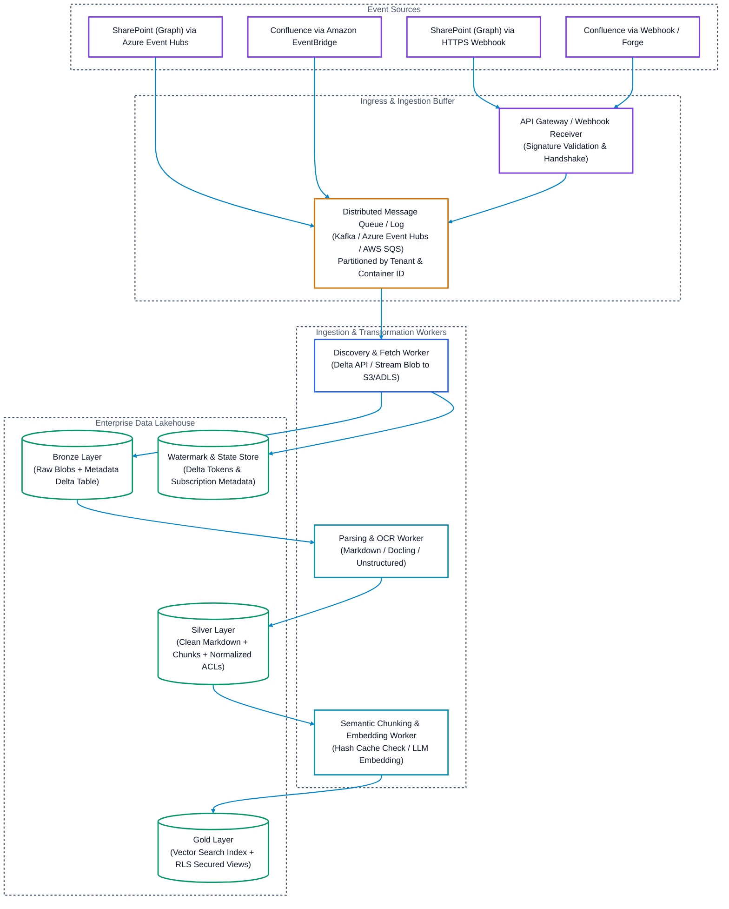
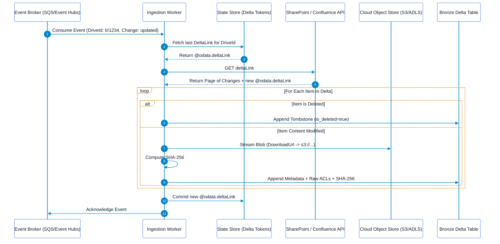

# Event-Driven Document Ingestion Architecture & Pipeline Patterns

## Executive Summary
This document defines the production-ready, event-driven architectural patterns for ingesting unstructured documents from Microsoft SharePoint and Atlassian Confluence into an Enterprise Data Lakehouse (Delta Lake / Apache Iceberg).

It addresses real-world engineering challenges: **out-of-order event delivery, dropped webhooks, mass-burst throttling, credential renewal, and late-binding security enforcement.**

---

## 1. End-to-End Event Ingress Topology



---

## 2. Core Architectural Pattern: "Notification-Triggered Delta Sync"

A common architectural antipattern is treating a webhook notification as the complete source of truth and assuming every changed file will have a distinct, successfully delivered webhook.

### Why Webhooks Alone Fail in Production:
1. **Network Glitches**: Webhooks are delivered via HTTP POST ("best effort"). Dropped connections result in permanently lost updates.
2. **Out-of-Order Delivery**: Under high concurrency, an "update" event may arrive *before* a "create" event for the same file.
3. **Mass Bursts**: If an administrator copies a directory containing 10,000 files, the source platform emits 10,000 webhook events simultaneously, creating a severe denial-of-service spike on downstream extraction workers.

### The Solution: Notification as a Wake-Up Signal
* The incoming webhook event is treated solely as a **wake-up trigger** that indicates: *"Container X (Drive or Space) has modifications."*
* The worker locks the container, reads the last committed `@odata.deltaLink` or cursor, and drains the changes via the native **Delta Query API**.



---

## 3. Reliability & Operational Guardrails

### A. Graph Subscription Auto-Renewal Daemon
Microsoft Graph Drive subscriptions expire in a maximum of **4,230 minutes (~2.9 days)**.
* **Architecture**: Deploy a lightweight recurring job (e.g., cron on Kubernetes or serverless timer):
  ```python
  # Runs every 6 hours
  def renew_expiring_subscriptions(db_session, graph_client):
      threshold = datetime.utcnow() + timedelta(hours=12)
      expiring_subs = db_session.query(Subscription).filter(Subscription.expires_at < threshold).all()
      for sub in expiring_subs:
          new_expiry = datetime.utcnow() + timedelta(days=2)
          graph_client.patch(f"/subscriptions/{sub.id}", json={
              "expirationDateTime": new_expiry.isoformat() + "Z"
          })
          sub.expires_at = new_expiry
          db_session.commit()
  ```

### B. Daily Reconciliation Sweeper (Self-Healing Ingestion)
To guarantee 100% data consistency even if webhooks fail:
* A scheduled batch sweeper runs every 24 hours.
* It invokes the Delta API using the stored `@odata.deltaLink`.
* If zero changes are returned, the lakehouse is verified in sync.
* If changes are returned, they are drained immediately, healing any dropped webhook events without human intervention.

### C. Tombstone Propagation & Vector Purging
When an item is deleted in SharePoint or Confluence:
1. The Delta Query returns `@removed: {"reason": "deleted"}` or Confluence fires `page_removed`.
2. Bronze table logs a tombstone record:
   `INSERT INTO bronze_documents VALUES (item_id, ..., is_deleted=TRUE, deleted_at=CURRENT_TIMESTAMP)`.
3. Silver pipeline flags all corresponding chunks:
   `UPDATE silver_chunks SET is_active = FALSE WHERE item_id = :item_id`.
4. The Vector Store executor deletes vectors by metadata filter:
   `vector_db.delete(filter={"item_id": item_id})`.
5. *Result*: Zombie chunks are purged immediately, eliminating outdated citations in enterprise RAG.

---

## 4. Reference Event Payload Schemas (Pydantic / Python)

```python
from pydantic import BaseModel, Field
from typing import Optional, List, Dict, Any
from datetime import datetime

class UnifiedChangeEvent(BaseModel):
    """Normalized internal representation for all incoming events."""
    event_id: str
    source_system: str  # 'sharepoint' | 'confluence'
    tenant_id: str
    container_id: str  # drive_id or space_key
    item_id: Optional[str] = None
    event_type: str    # 'created' | 'updated' | 'deleted' | 'permissions_changed'
    event_timestamp: datetime
    raw_payload: Dict[str, Any]

class DocumentMetadataRecord(BaseModel):
    """Bronze Layer Metadata Schema."""
    source_system: str
    tenant_id: str
    container_id: str
    item_id: str
    version_id: str
    file_name: str
    mime_type: str
    content_sha256: str
    raw_blob_uri: str
    raw_acls: Dict[str, Any]
    is_deleted: bool = False
    source_modified_at: datetime
    ingestion_timestamp: datetime = Field(default_factory=datetime.utcnow)
```
