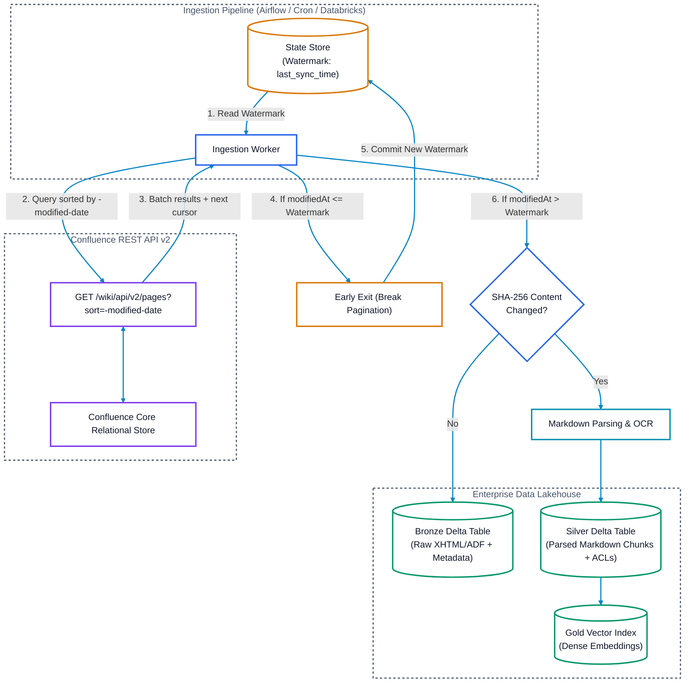

# Confluence Pull-Based Ingestion: Features, APIs & Deep Dive

## Executive Summary
While event-driven webhooks deliver real-time triggers, **pull-based ingestion** is a critical architectural pillar for Atlassian Confluence document pipelines. Pull-based architectures provide:
1. **Initial Historical Cold-Start**: Ingesting spaces, historical revisions, and attachments created before pipeline deployment.
2. **Reliable Self-Healing**: Resynchronizing after network partitions or webhook listener downtime where Atlassian webhook retries were exhausted.
3. **Firewall-Friendly Ingress**: Querying Confluence entirely via outbound HTTPS requests without exposing public webhooks, load balancers, or reverse proxies.

Unlike Microsoft Graph (which provides a single unified `@odata.deltaLink`), Confluence provides two primary pull mechanisms:
* **Confluence REST API v2 Cursor Traversal** (Recommended for point-in-time, cursor-based pagination).
* **Confluence Query Language (CQL) Search API** (Recommended for multi-type, multi-space, and parallel date-sliced crawls).

---

## 1. Feature 1: Confluence REST API v2 Cursor Traversal

The **Confluence REST API v2** is the modern standard for Confluence Cloud. It replaces legacy numeric offsets (`start=10000`) with **opaque cursor tokens**, providing consistent $O(1)$ pagination performance regardless of workspace size.



### A. Key Endpoints
* **Pages**: `GET https://{your-domain}.atlassian.net/wiki/api/v2/pages`
* **Blogposts**: `GET https://{your-domain}.atlassian.net/wiki/api/v2/blogposts`
* **Attachments**: `GET https://{your-domain}.atlassian.net/wiki/api/v2/attachments`

### B. The "Descending Sort + Early-Exit" Algorithm
To perform incremental sync without scanning all historical documents:
1. Pass `sort=-modified-date` to order results from newest modification to oldest.
2. Pass `status=current,trashed` to ensure soft-deleted pages are returned.
3. On the first page, record the `modified-date` of the first item as `new_high_watermark`.
4. Traverse through items. For each item:
   * If `item.modified_date > last_sync_watermark`: Ingest or tombstone the item.
   * If `item.modified_date <= last_sync_watermark`: **Stop pagination immediately (Early Exit)**. Since the results are sorted descending, all subsequent pages are guaranteed to be older.
5. Commit `new_high_watermark` to your state store.

### C. Sample Request & Response
```http
GET /wiki/api/v2/pages?sort=-modified-date&status=current,trashed&limit=250&body-format=storage HTTP/1.1
Host: company.atlassian.net
Authorization: Bearer <api_token>
```

```json
{
  "results": [
    {
      "id": "10485761",
      "status": "current",
      "title": "Lakehouse Storage Patterns",
      "spaceId": "589824",
      "version": {
        "number": 5,
        "createdAt": "2026-09-16T08:30:00.000Z"
      },
      "body": {
        "storage": {
          "value": "<p>Storage format XHTML content...</p>"
        }
      }
    }
  ],
  "_links": {
    "next": "/wiki/api/v2/pages?cursor=eyJpZCI6IjEwNDg1NzYiLCJtb2RpZmllZERhdGUiOjE3NzM2NDIwMDB9&limit=250&sort=-modified-date&status=current%2Ctrashed"
  }
}
```

---

## 2. Feature 2: Confluence Query Language (CQL) Search API

When you need to ingest across multiple entity types (pages, blogposts, attachments) in a single request, or when filtering by multiple spaces, **CQL** is the most flexible mechanism.

* **Endpoint**: `GET https://{your-domain}.atlassian.net/wiki/rest/api/content/search`
* **Supports**: Confluence Cloud and Confluence Data Center / Server.

### A. Incremental Ingestion via CQL Sliding Windows
You can express incremental queries using `lastModified` comparisons:
```http
GET /wiki/rest/api/content/search?cql=lastModified+%3E%3D+"2026-09-15+08:00"+and+lastModified+%3C+"2026-09-16+08:00"+and+status+in+(current,trashed)+and+type+in+(page,blogpost,attachment)+order+by+lastModified+asc&limit=100&start=0 HTTP/1.1
Host: company.atlassian.net
Authorization: Bearer <api_token>
```

### Key Advantages of CQL for Incremental Pull:
1. **Multi-Type in a Single Stream**: `type in (page, blogpost, attachment)` eliminates having to maintain 3 separate endpoint crawls.
2. **Multi-Space Scoping**: Restrict ingestion to specific spaces: `space in ("ENG", "LEGAL", "PRODUCT")`.
3. **Ascending Chronological Order**: `order by lastModified asc` allows sliding windows where you advance the watermark as you page through.

### B. Parallel Bounded Slicing for Historical Backfills
For massive historical crawls (e.g. 500,000 pages), sequential cursor traversal can create a bottleneck. CQL allows splitting historical data into time-bounded slices distributed across parallel worker nodes:

* **Worker 1**: `cql=created >= "2023-01-01" AND created < "2023-07-01" AND status in (current, trashed)`
* **Worker 2**: `cql=created >= "2023-07-01" AND created < "2024-01-01" AND status in (current, trashed)`
* **Worker 3**: `cql=created >= "2024-01-01" AND created < "2024-07-01" AND status in (current, trashed)`

### C. Critical CQL Operational Caveats:
1. **The 10,000 Result Offset Limit**:
   In large instances, CQL search queries can degrade or truncate if paginating deep offsets (`start > 10,000`). Always partition your queries into temporal slices so each slice contains under 5,000 results.
2. **Search Indexing Lag**:
   CQL relies on Confluence's Lucene/Elasticsearch index. Edits take **1 to 5 seconds** to appear in search results. Always include a 2-minute safety buffer (`lastModified < now() - 2 minutes`) on incremental queries to prevent race conditions during active edits.

---

## 3. Feature 3: Version History & Checksum Detection

To minimize LLM embedding costs and avoid redundant parsing:

### A. Version Number Fast-Check
* **Endpoint**: `GET /wiki/api/v2/pages/{id}/versions`
* Each edit generates a strictly increasing integer `version.number`.
* If `incoming_version == stored_version`, skip fetching the body and bypass processing.

### B. `SHA-256` Content Hashing
Confluence updates page versions even for minor metadata modifications (e.g. adding labels or reordering page tree navigation).
* Compute `SHA-256` of `body.storage.value` or `body.atlas_doc_format.value`.
* If the content hash is identical to Bronze, update metadata only; skip document parsing, chunking, and vector embedding.

---

## 4. Feature 4: Audit Log API (Tracking Security & Permissions)

When space permissions or page restrictions change, document body content remains unaltered, but query-time access control lists (ACLs) must be updated.

* **Endpoints**:
  * Cloud: `GET /wiki/api/v2/audit-records`
  * Data Center: `GET /wiki/rest/api/audit`
* **Tracked Events**: `Space Permissions Changed`, `Page Restriction Added`, `Group Membership Modified`.
* Allows incremental triggering of ACL re-evaluations in the Silver layer without re-reading the entire page body.

---

## 5. Deletions and Tombstone Lifecycle in Pull Ingestion

Confluence handles deletions in two stages:
1. **Soft Delete (`trashed`)**:
   * The page is moved to the Space Trash.
   * Captured by querying `status=current,trashed`.
   * **Action**: Emit a tombstone record (`is_deleted = true`); immediately purge corresponding vectors from the vector index.
2. **Permanent Purge (`removed`)**:
   * An administrator empties the trash or deletes the page permanently.
   * The page is purged from the Confluence database and will **not** appear in descending modified date queries.
   * **Action**: Run a weekly reconciliation diff against the Lakehouse catalog to detect missing IDs and emit permanent purges.

---

## 6. Production Python Implementation: REST API v2 Incremental Sync

```python
import os
import requests
import hashlib
from typing import Optional, Dict, Any

CONFLUENCE_BASE_URL = "https://company.atlassian.net"

class ConfluenceIncrementalIngestor:
    def __init__(self, api_token: str, state_store, lakehouse):
        self.api_token = api_token
        self.state_store = state_store
        self.lakehouse = lakehouse
        self.headers = {
            "Authorization": f"Bearer {self.api_token}",
            "Accept": "application/json"
        }

    def sync_pages(self, space_id: Optional[str] = None):
        # 1. Fetch last recorded watermark
        last_watermark = self.state_store.get_watermark("confluence_pages")
        
        url = f"{CONFLUENCE_BASE_URL}/wiki/api/v2/pages"
        params = {
            "sort": "-modified-date",
            "status": "current,trashed",
            "limit": 250,
            "body-format": "storage"
        }
        if space_id:
            params["space-id"] = space_id

        new_watermark: Optional[str] = None
        reached_watermark = False
        total_synced = 0
        total_tombstones = 0

        while url and not reached_watermark:
            resp = requests.get(
                url,
                headers=self.headers,
                params=params if "_links" not in url else None
            )
            resp.raise_for_status()
            data = resp.json()
            results = data.get("results", [])

            if not results:
                break

            # Capture highest watermark from the first item
            if new_watermark is None:
                new_watermark = results[0]["version"]["createdAt"]

            for page in results:
                page_id = page["id"]
                page_status = page["status"]
                modified_at = page["version"]["createdAt"]
                version_num = page["version"]["number"]

                # EARLY EXIT CONDITION
                if last_watermark and modified_at <= last_watermark:
                    reached_watermark = True
                    break

                # Handle Deletion (Tombstone)
                if page_status == "trashed":
                    self.lakehouse.emit_tombstone(page_id=page_id, is_deleted=True)
                    total_tombstones += 1
                    continue

                # Process Content
                storage_body = page.get("body", {}).get("storage", {}).get("value", "")
                content_hash = hashlib.sha256(storage_body.encode("utf-8")).hexdigest()

                self.lakehouse.upsert_page(
                    page_id=page_id,
                    title=page["title"],
                    version=version_num,
                    modified_at=modified_at,
                    space_id=page["spaceId"],
                    content_hash=content_hash,
                    raw_content=storage_body
                )
                total_synced += 1

            # Follow cursor pagination
            next_cursor = data.get("_links", {}).get("next")
            if next_cursor and not reached_watermark:
                url = f"{CONFLUENCE_BASE_URL}{next_cursor}"
                params = None
            else:
                url = None

        # 2. Persist new watermark
        if new_watermark:
            self.state_store.set_watermark("confluence_pages", new_watermark)
            print(f"Sync complete. Updated: {total_synced}, Tombstoned: {total_tombstones}. Watermark: {new_watermark}")
```

---

## 7. Comparison Matrix: Pull Strategies in Confluence

| Dimension | REST API v2 Cursor Traversal | CQL Search API (`/content/search`) |
| :--- | :--- | :--- |
| **Primary Ingestion Use Case** | Incremental sync & continuous watermarking | Multi-space, multi-type & parallel historical slicing |
| **Pagination Mechanism** | **Opaque Cursor Tokens** ($O(1)$ scaling) | Offset-based (`start` & `limit`) |
| **Deep Pagination Scaling** | **No degradation** (Scales to millions of items) | Degrades if single query exceeds >10,000 items |
| **Multi-Type Ingestion** | Separate endpoints for pages, attachments, blogposts | **Single Query**: `type in (page, blogpost, attachment)` |
| **Data Freshness** | Real-time (Reads directly from relational store) | Near Real-time (1–5s Lucene indexing lag) |
| **Sorting** | Supports `sort=-modified-date` | Supports `order by lastModified asc/desc` |
