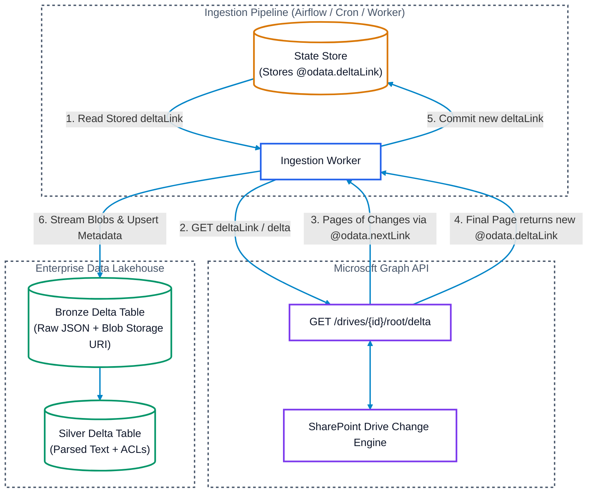

# SharePoint & OneDrive Pull-Based Ingestion: Features, APIs & Deep Dive

## Executive Summary
While event-driven push architectures (webhooks) provide low-latency notifications, **pull-based ingestion** is an essential foundation for enterprise document pipelines. Pull-based architectures are required for:
1. **Initial Historical Backfill (Cold Start)**: Ingesting existing document libraries containing hundreds of thousands of files.
2. **Periodic Reconciliation & Self-Healing**: Catching events dropped due to webhook delivery timeouts, network partitions, or expired subscriptions.
3. **Restricted Security Environments**: Operating within enterprise intranets or air-gapped VPCs where opening public inbound firewall ports for webhooks is strictly prohibited.

In the Microsoft 365 ecosystem, pull-based incremental ingestion is powered by the **Microsoft Graph Delta Query API (`/delta`)**, augmented by **OData query filters**, **SharePoint Change Logs**, and **Search (KQL) APIs**.

---

## 1. Feature 1: Microsoft Graph Delta Query API (`/delta`)

The **Delta Query API** is the gold standard for incremental pull ingestion in SharePoint and OneDrive. It allows an application to discover newly created, updated, or deleted `DriveItems` without performing full recursive directory scans.



### A. Supported Delta Query Scopes
* **Drive Level (Document Library)**: `GET https://graph.microsoft.com/v1.0/drives/{drive-id}/root/delta`
  * Recursively tracks all files, folders, and subfolders across the entire SharePoint document library.
* **Site Document List**: `GET https://graph.microsoft.com/v1.0/sites/{site-id}/lists/{list-id}/items/delta`
  * Tracks list items and attachments.
* **Folder Level**: `GET https://graph.microsoft.com/v1.0/drives/{drive-id}/items/{folder-id}/delta`
  * Scoped strictly to a specific folder hierarchy.
* **User OneDrive**: `GET https://graph.microsoft.com/v1.0/users/{user-id}/drive/root/delta`

### B. Delta Query Mechanics: Initial Load vs. Incremental Pull

1. **Initial Full Crawl**:
   * Request: `GET https://graph.microsoft.com/v1.0/drives/{drive-id}/root/delta`
   * Microsoft Graph returns batches of DriveItems with an `@odata.nextLink` containing a pagination token.
   * The client follows `@odata.nextLink` until the last page.
   * The final page contains an `@odata.deltaLink`. This opaque URL represents the **state watermark** marking the exact point in time of the completed sync.

2. **Subsequent Incremental Pulls**:
   * Request: Call the saved `@odata.deltaLink` URL directly:
     ```http
     GET https://graph.microsoft.com/v1.0/drives/{drive-id}/root/delta?token=abC123XyZ_delta_token HTTP/1.1
     Host: graph.microsoft.com
     Authorization: Bearer <access_token>
     ```
   * Microsoft Graph returns **only items modified, added, renamed, moved, or deleted** since that token was generated.
   * Follow any `@odata.nextLink` pages until a new `@odata.deltaLink` is returned.
   * Atomically persist the new `@odata.deltaLink` into your state store.

### C. Native Tombstone Handling (`@removed`)
Unlike standard REST endpoints where deleted items simply vanish, the Delta Query API treats deletions as first-class objects:
```json
{
  "@odata.type": "#microsoft.graph.driveItem",
  "id": "01ABCD5678EFGH",
  "name": "Q3_Financial_Forecast.xlsx",
  "@removed": {
    "reason": "deleted"
  }
}
```
* When `@removed` is detected, the ingestor immediately writes a tombstone record (`is_deleted = true`) to the Bronze Delta table and triggers a delete operation in the downstream vector search index to prevent zombie hallucinations.

### D. Token Expiry & Resync Handling (`HTTP 410 Gone`)
* Delta tokens can expire (typically after 30 days of inactivity, or if internal SharePoint transaction logs roll over).
* **Failure Response**: `HTTP 410 Gone` with code `resyncRequired`.
* **Recovery Protocol**:
  1. Trap `HTTP 410`.
  2. Clear the stale `deltaLink` from the state store.
  3. Initiate a fresh initial sync (`GET /delta`), performing a full reconciliation against existing records in Bronze.

---

## 2. Feature 2: OData Query Filtering & Timestamp Watermarking

When delta query is unavailable for custom endpoints, or when pulling a flat list of items scoped to a single folder, Microsoft Graph supports standard OData temporal filtering.

### A. Timestamp Filtering API
```http
GET https://graph.microsoft.com/v1.0/drives/{drive-id}/root/children?$filter=lastModifiedDateTime ge 2026-09-15T00:00:00.000Z&$orderby=lastModifiedDateTime asc HTTP/1.1
Host: graph.microsoft.com
Authorization: Bearer <access_token>
```

### B. Limitations Compared to Delta Query
| Dimension | Delta Query (`/delta`) | OData Filtering (`$filter=lastModifiedDateTime`) |
| :--- | :--- | :--- |
| **Directory Traversal** | **Recursive** (All subfolders across entire drive) | **Shallow** (Direct children of folder only; requires manual recursion) |
| **Deletions / Tombstones** | **Automatic** (Emits `@removed` facet) | **None** (Deleted files vanish; requires full catalog diff) |
| **File Moves & Renames** | **Automatic** (Emits updated item with new parent ID) | Difficult to track (Appears only as timestamp bump) |
| **API Throttling Overhead** | 1 single stream | High (Multiple nested folder requests) |

---

## 3. Feature 3: SharePoint Search REST API (KQL / Keyword Query Language)

For multi-site or tenant-wide discovery, SharePoint Search enables querying across multiple site collections in a single pull request.

* **Endpoint**: `GET https://{tenant}.sharepoint.com/_api/search/query`
* **Incremental KQL Query**:
  ```
  querytext='LastModifiedTime>=2026-09-15T00:00:00Z AND ContentClass:STS_ListItem_DocumentLibrary'
  &selectproperties='Title,Path,Author,LastModifiedTime,FileExtension,Size,DocId'
  &sortlist='LastModifiedTime:ascending'
  &rowlimit=500
  ```
* **Use Case**: Cross-site collection discovery where maintaining hundreds of individual delta query tokens is impractical.

---

## 4. Binary Downloads & Content Integrity Verification

In strict compliance with Lakehouse architecture rules, binary files are **never** stored inside table rows. Instead, they are streamed to Cloud Object Storage (`s3://`, `abfss://`, `gs://`).

### A. Direct Pre-Authenticated Download URLs
Every file DriveItem returned in the Delta response includes:
```json
{
  "id": "01ABCD5678EFGH",
  "name": "annual_report.pdf",
  "size": 15482910,
  "@microsoft.graph.downloadUrl": "https://company.sharepoint.com/:u:/r/personal/...",
  "file": {
    "mimeType": "application/pdf",
    "hashes": {
      "quickXorHash": "f8XgA+9KjLw4Z5...",
      "sha256Hash": "a1b2c3d4e5f6..."
    }
  }
}
```
* `@microsoft.graph.downloadUrl`: Short-lived, pre-authenticated direct download URL served by Microsoft Azure Front Door CDN. Workers stream directly from this URL without sending Graph API bearer tokens.

### B. Hash Checking & Idempotency (FinOps Optimization)
* Microsoft Graph provides built-in file hashes (`quickXorHash` and often `sha256Hash`).
* For local parsing, compute the `SHA-256` of the downloaded binary stream.
* If `current_sha256 == stored_sha256`, update metadata only; skip expensive OCR, document layout parsing (Docling), and embedding LLM API calls.

---

## 5. Incremental ACL & Security Permission Extraction

SharePoint permissions can be inherited from the parent site/folder or explicitly broken (unique permissions).

### A. Detecting Broken Inheritance
In the item payload:
```json
{
  "id": "01ABCD5678EFGH",
  "name": "Confidential_Executive_Compensation.docx",
  "hasUniqueRoleAssignments": true
}
```
* If `hasUniqueRoleAssignments == false`: The document inherits all permissions from its parent folder/drive. The ingestor binds the parent container's security group IDs.
* If `hasUniqueRoleAssignments == true`: Unique permissions have been configured. The ingestor must query the item's permission endpoint.

### B. Fetching Item Permissions
* **Endpoint**: `GET https://graph.microsoft.com/v1.0/drives/{drive-id}/items/{item-id}/permissions`
* Returns granted Entra ID (Azure AD) user IDs, security groups, and sharing links.
* In the Silver layer, these principals are stored as normalized security group IDs (`allowed_principals: ["grp_engineering", "user_1234"]`) to enable query-time late-binding Access Control.

---

## 6. Production Python Implementation: Incremental Delta Ingestor

```python
import os
import requests
import hashlib
from typing import Optional, Dict, Any

GRAPH_BASE_URL = "https://graph.microsoft.com/v1.0"

class SharePointDeltaIngestor:
    def __init__(self, drive_id: str, access_token: str, state_store, lakehouse):
        self.drive_id = drive_id
        self.access_token = access_token
        self.state_store = state_store
        self.lakehouse = lakehouse
        self.headers = {
            "Authorization": f"Bearer {self.access_token}",
            "Accept": "application/json",
            "Prefer": "deltashowremoveddatashowalternatechangekey"
        }

    def run_sync(self):
        # 1. Retrieve stored deltaLink (or start fresh)
        delta_link = self.state_store.get_delta_link(self.drive_id)
        current_url = delta_link or f"{GRAPH_BASE_URL}/drives/{self.drive_id}/root/delta"
        
        new_delta_link: Optional[str] = None
        total_synced = 0
        total_deleted = 0

        while current_url:
            resp = requests.get(current_url, headers=self.headers)
            
            # Handle token expiration (HTTP 410)
            if resp.status_code == 410:
                print("Delta token expired (HTTP 410). Resetting state and running full sync...")
                self.state_store.clear_delta_link(self.drive_id)
                current_url = f"{GRAPH_BASE_URL}/drives/{self.drive_id}/root/delta"
                continue

            resp.raise_for_status()
            data = resp.json()
            items = data.get("value", [])

            for item in items:
                item_id = item.get("id")
                
                # Check for Deletion (Tombstone)
                if "@removed" in item:
                    self.lakehouse.emit_tombstone(
                        drive_id=self.drive_id,
                        item_id=item_id,
                        reason=item["@removed"].get("reason", "deleted")
                    )
                    total_deleted += 1
                    continue

                # Process Files (ignore pure folder containers)
                if "file" in item:
                    self._process_file(item)
                    total_synced += 1

            # Check for next page link vs completion delta link
            if "@odata.nextLink" in data:
                current_url = data["@odata.nextLink"]
            elif "@odata.deltaLink" in data:
                new_delta_link = data["@odata.deltaLink"]
                current_url = None
            else:
                current_url = None

        # 2. Commit new state token atomically
        if new_delta_link:
            self.state_store.save_delta_link(self.drive_id, new_delta_link)
            print(f"Sync complete. Updated: {total_synced}, Deleted: {total_deleted}")

    def _process_file(self, item: Dict[str, Any]):
        item_id = item["id"]
        download_url = item.get("@microsoft.graph.downloadUrl")
        c_tag = item.get("cTag")
        
        # Check existing metadata in Bronze
        stored_c_tag = self.lakehouse.get_content_tag(item_id)
        if stored_c_tag and stored_c_tag == c_tag:
            # Metadata update only, skip binary download
            self.lakehouse.update_metadata(item_id, item)
            return

        # Stream binary directly to Cloud Storage
        cloud_uri = self.lakehouse.stream_blob_to_cloud_storage(
            download_url=download_url,
            destination_key=f"raw/sharepoint/{self.drive_id}/{item_id}/{item['name']}"
        )

        # Write to Bronze Delta Table
        self.lakehouse.upsert_bronze(
            drive_id=self.drive_id,
            item_id=item_id,
            name=item["name"],
            cloud_uri=cloud_uri,
            c_tag=c_tag,
            metadata=item
        )
```

---

## 7. Operational Guardrails & Throttling (HTTP 429)

Microsoft Graph aggressively protects SharePoint infrastructure with dynamic rate limiting.

### Mandatory Backoff Protocol:
1. **HTTP 429 Status**: Microsoft Graph returns `429 Too Many Requests`.
2. **`Retry-After` Header**: The response contains a mandatory `Retry-After: <seconds>` header.
3. **Exponential Backoff with Jitter**:
   $$\text{Sleep Time} = \max(\text{Retry-After}, 2^{\text{attempt}}) + \text{random\_jitter}(0, 1)$$
4. **Batch Size Tuning**: Requesting `$top=200` to `$top=500` strikes the optimal balance between HTTP roundtrip overhead and response payload timeouts.
